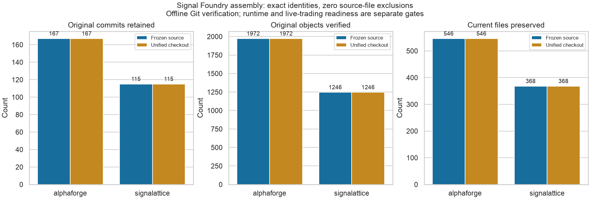
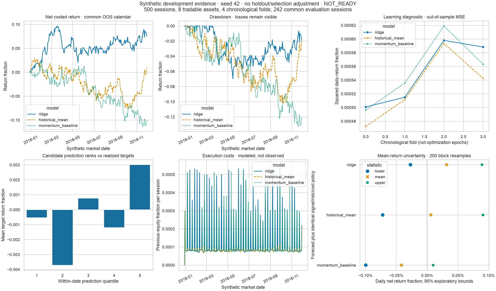

# Signal Foundry

Local-first quantitative research, from data provenance to strategy and risk evidence.

This repository assembles [AlphaForge](https://github.com/srgangaram-swe/AlphaForge)
and [Signalattice](https://github.com/srgangaram-swe/Signalattice) without rewriting
their histories or merging their dependency environments. Both source repositories
remain intact. A typed, loopback-only control plane now runs bounded research jobs
and publishes immutable diagnostic evidence. The Nexus workstation is the next
delivery; it is not yet included on this branch.

**Research and simulation only. No broker connection or live-order route.**
The recorded capital-readiness verdict remains `NOT_READY`. Tests establish
software properties, not a profitable trading strategy.

## Repository layout

- `packages/alphaforge`: unchanged research, strategy, portfolio, risk and execution
  simulation package, with its original tests, C++ core, dashboards and evidence.
- `packages/signalattice`: unchanged data, provenance, forecasting and read-only
  observability package, including its existing web console.
- `foundry_build`: offline history verification and package-context adapters.
- `signal_foundry`: versioned contracts, isolated workers, durable jobs and local API.
- `contracts`: generated OpenAPI and TypeScript bindings from one schema.
- `provenance/assembly.json`: frozen source identities, object hashes, namespaced
  ref mappings and the recorded historical-license determination.
- `apps/nexus`: planned in [AlphaForge #81](https://github.com/srgangaram-swe/AlphaForge/issues/81).

## Verify a checkout

Use a full clone, Python 3.13 and the committed uv resolution. Source environments
remain separate: AlphaForge and Signalattice currently lock different pandas and
other integration dependencies.

```bash
git clone https://github.com/srgangaram-swe/SignalFoundry.git
cd SignalFoundry
git switch dev
uv sync --locked --extra dev
uv sync --project packages/alphaforge --locked --extra dev --extra data
uv sync --project packages/signalattice --locked --extra dev
uv run python -m foundry_build.assembly verify
uv run python -m foundry_build.context alphaforge
uv run python -m foundry_build.context signalattice
uv run signal-foundry serve
```

Open `http://127.0.0.1:8765/api/v1/catalog` to inspect the actual model/strategy
registries. See the [research workflow and launch guide](docs/control-plane.md)
for validated configuration, historical bundles, jobs, cancellation and evidence.
No credentials belong in the browser. Original dashboards remain available.

The context commands generate ignored package-local `.git` pointers backed by
independent object copies inside the unified `.git` directory. They do not clone
source worktrees or fetch credentials/network data. They allow original tools to
resolve original root-relative source paths and tags while operating **inside the
prefixed package directories**. Do not commit from these compatibility contexts;
make reviewed changes on a work branch at the unified repository root.

See [assembly architecture and recovery](docs/assembly.md),
[validation evidence](docs/assembly_validation.md), [contribution workflow](CONTRIBUTING.md)
and [security boundaries](SECURITY.md).



## Research and engineering evidence

The [control-plane report](docs/control-plane-validation.md) distinguishes local
software checks, measured workstation resources, synthetic research and cached
historical-data integration. Candidate and baseline losses remain visible; none
of these demonstrations establishes a profitable strategy.



## Preserved limitation

[Signalattice #67](https://github.com/srgangaram-swe/Signalattice/issues/67)
tracks an existing clean-container metadata reproducibility failure. Its source
workflow is retained as a visible, non-required job, matching the source branch
policy. All source-required checks remain mandatory through aggregate gates.
Assembly does not resolve that issue or qualify live deployment.
