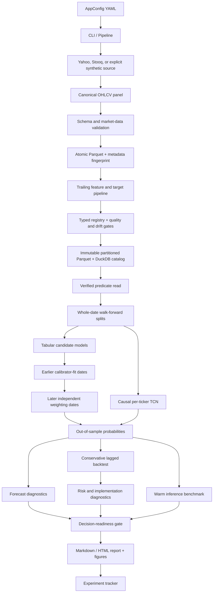

# Architecture

Signalattice is a config-driven research DAG with explicit contracts between data,
forecasting, decision simulation, and evidence generation. Stages can run independently
from the CLI; `Pipeline.run_full()` executes them in one tracked experiment.

## Component flow



## Core packages

- `quant_platform.config`: Pydantic contracts for YAML configuration and selected
  environment overrides.
- `quant_platform.data`: source adapters, canonical schema, quality validation, explicit
  synthetic data generation, atomic persistence, and cache fingerprints.
- `quant_platform.features`: ticker-local trailing features, same-date cross-sectional
  transforms, forward targets, typed feature/fitted-state registry, quality and drift
  evidence, an immutable DuckDB/Parquet store, and resumable backfills.
- `quant_platform.models`: panel-aware splits, estimator construction, chronological
  calibration, heterogeneous ensembling, causal temporal convolution, walk-forward
  training, probability diagnostics, and model persistence.
- `quant_platform.backtest`: vectorized long-only or long/short decision simulation with
  conservative timing, turnover costs, no-trade bands, and portfolio limits.
- `quant_platform.evaluation`: cost/delay frontiers, break-even costs, dollar-volume
  participation, warm inference benchmarks, and independent readiness criteria.
- `quant_platform.risk`: performance, drawdown, VaR/CVaR, beta, exposures, correlations,
  and scenario calculations.
- `quant_platform.tracking`: backward-compatible SQLite, JSON, MLflow, and no-op experiment
  adapters plus the explicit-bootstrap durable local job/run registry, append-only lifecycle
  events, content-addressed evidence store, retention protocol, and framework-neutral read ports.
- `quant_platform.service`: strict aggregate evidence manifests, public projections, a bounded
  read-port protocol, redacted RFC 9457 failures, a raw ASGI security envelope, fixed-cardinality
  metrics/local telemetry, a pinned h11 parser/admission adapter, and the fixed loopback-only
  Uvicorn assembly. Uvicorn is configured at 32; the adapter corrects its inclusive decision and
  emits structured transport saturation, while the outer controller independently mirrors the
  global 32 ceiling and owns the 24-data split. The Unix profile passes a pre-bound, verified
  mode-0600 descriptor so Uvicorn
  cannot widen socket permissions. The optional adapter owns no SQL, filesystem mutation, broker,
  order, or live-trading authority. The dedicated image uses the narrow stdlib
  `python -m quant_platform.service` entry point plus the locked `service-runtime` group; lazy
  tracking-package exports keep the numerical research dependency graph outside that process.
- `quant_platform.reporting`: diagnostic figures and self-contained run reports.
- `quant_platform.cli`: Typer commands for individual stages and full runs.

## Data contracts

The canonical price panel is long format with a unique `(date, ticker)` key:

```text
date | ticker | open | high | low | close | adj_close | volume | return | log_return
```

The feature matrix preserves the key and adds:

```text
f_* | target_forward_return | target_direction
```

Feature selection is prefix-based and explicit. Identifier, target, and future-return
columns are not inferred as model inputs. Temporal inputs are constructed as
`[sample, time, feature]` tensors from the history of the same ticker; sequence metadata
retains the prediction row and contributing history rows.

The out-of-sample prediction frame is the sole model signal accepted by the model-backed
backtest:

```text
date | ticker | y_true | forward_return | score | fold | candidate_*
```

`score` is `P(up)` for classification or a point forecast for regression. Candidate
columns are present for the calibrated ensemble when available.

## Invariants

| Boundary | Enforced invariant |
|---|---|
| Data source | All requested tickers must be returned; synthetic substitution is explicit and labeled. |
| Cache | Reuse requires a matching data/config/seed fingerprint. |
| Panel | Keys are unique and prices, OHLC bounds, volume, and minimum history are validated. |
| Features | Rolling inputs are trailing; cross-sectional transforms use only the same date; fitted state must end before application. |
| Feature store | Identity binds source, registry, fit interval, code/runtime, policy, logical content, and verified immutable partitions. |
| Outer evaluation | Entire dates move together and every test date is after training plus embargo. |
| Ensemble selection | Candidate fit dates precede calibrator-fit dates; independent weighting dates follow before embargo and outer test. |
| Temporal model | Every history element belongs to the sample ticker and occurs no later than the prediction row. |
| Backtest | Close-derived decisions incur at least the configured two-row execution lag. |
| Portfolio | Per-name and gross limits are re-applied after volatility scaling; missing held returns raise. |
| Readiness | Missing or non-finite evidence fails its criterion; there is no compensating weighted score. |

These invariants are executable contracts covered by unit or integration tests, not just
diagram annotations.

## Artifact lineage

Typical outputs are:

- raw per-ticker snapshots: `data/raw/*.parquet`;
- immutable licensed-provider snapshots: `data/vendor/nasdaq-data-link/`;
- versioned AlphaForge exchange bundles: `data/signal-foundry-bundles/<bundle-id>/`;
- panel and source metadata: `data/processed/price_panel.parquet` and
  `panel_metadata.json`;
- immutable feature objects, DuckDB catalog, and resumable checkpoints under the ignored
  `data/feature-store/` root;
- persisted preprocessing/model bundle: `models/{project_name}_model.joblib`;
- report and figures: the configured `reports/` path; and
- experiment metadata: SQLite, JSON, or MLflow according to configuration.

The durable registry and CAS live under a separate ignored, owner-controlled local state root.
Their database, lifecycle, publication, recovery, and rollback contracts are documented in the
[registry operator guide](run_registry.md) and [ADR 0002](adr/0002-durable-local-registry.md).
The additive read-only service is qualified only inside the fixed local operating envelope in the
[service operations guide](service_operations.md), [service threat model](threat_model.md), and
[ADR 0004](adr/0004-bounded-service-operability.md).

Champion-challenger promotion is governed separately in `quant_platform.governance`, which layers
exact paired comparison, dependence-aware inference, absolute gates, and an append-only event chain
per lane. Automation there may compute, recommend, and freeze; it may never approve, apply, roll
back, or unfreeze. The design, the operational floor, and the residual risks are in
[ADR 0005](adr/0005-champion-challenger-promotion-governance.md), and its evidence figure is
regenerated by `scripts/plot_governance_evidence.py`.

Data and model artifacts are ignored because public-vendor redistribution and stale binary
outputs are poor reproducibility mechanisms. The repository commits only a documented
example report that can be regenerated from its config and seed.

## Deployment boundary

Signalattice stops at research decision-readiness. It now implements a bounded historical
Nasdaq Data Link adapter, a versioned as-of dataset exchange contract, and a local offline
feature store. Its durable registry is a single-host, at-least-once research control plane—not a
distributed queue or authorization system. These are not a real-time feed handler, online/distributed feature service,
or proof of complete point-in-time history. It does not implement a portfolio optimizer,
broker adapter, order management system, pre-trade risk service, or post-trade ledger.
Its inference and feature-store timings are laptop-scale local evidence. Its capacity
result covers trailing dollar-volume participation only. Those exclusions remain visible
in the report, [feature-store contract](feature_store.md), and [data card](data_card.md).
