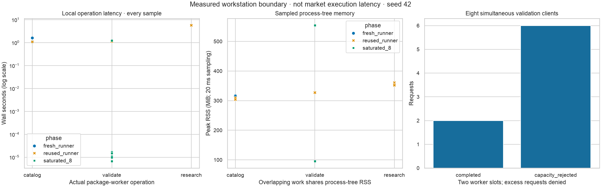

# Control-plane qualification evidence

Scope: AlphaForge #80, after the history-preserving assembly in SignalFoundry
PR #1. This is an additive local research API, not Nexus UI delivery, a model
qualification decision, a broker adapter or production deployment.

## Acceptance-to-evidence map

| Contract | Implementation and verification |
| --- | --- |
| One deterministic schema and typed client | Frozen Pydantic contracts; `foundry_build.contracts`; generated `contracts/openapi-v1.json` and `research-v1.d.ts`; schema drift and TypeScript checks |
| Registry-driven, fail-closed preflight | Actual source model/strategy discovery; numerical parameter policy; independent producer/consumer verification; actual fitted-transform checks on training folds |
| Reproducible research provenance | Request/data/control-code/source-code/environment hashes, explicit seed map, chronological windows, common OOS calendar, costs/limits, immutable canonical evidence |
| Bounded lifecycle and failures | SQLite atomic publication/audit; indexed idempotency; FIFO queue; cancellation/publication linearization; restart failure; worker resource and output limits |
| Real-boundary tests | Actual source interpreters, producer export and consumer research, HTTP job/evidence lifecycle, all five strategy paths, repeated-byte identity, unsupported model and incompatible-feature rejection |
| Security | Malformed/duplicate/nonfinite JSON; path and symlink rejection; bounded chunked/slow bodies; eight-request saturation; duplicate/foreign Host/Origin; no secret reflection; sanitized worker faults |
| Compatibility | Both imported source trees remain byte-identical; assembly verifier and original source-required workflows retained |

The source algorithms are reused, not reimplemented in HTTP or the client.
Expected operations are finite and bounded: FIFO scheduling is O(1), retained
jobs are capped at 64, idempotency uses a unique SQLite index, and aggregate
projection is bounded by 24 tables × 2,048 rows × 24 columns plus a 4 MiB artifact
ceiling. Parsing and canonical hashing are linear in bounded payload/source bytes.
Training/backtesting complexity remains the selected source algorithm's cost;
resource limits are containment, not an algorithmic speedup claim.

## Local test and build procedure

The final local root run passed **207 tests** in 114.36 seconds with **94.00%**
branch-inclusive coverage (required floor: 90%). Black, Ruff and strict mypy
passed across all 24 implementation/tooling modules. This includes actual locked
worker processes; the unchanged source repositories have additional required CI
suites rather than being counted in the root test total.

```bash
uv run black --check foundry_build signal_foundry tests
uv run ruff check foundry_build signal_foundry tests
uv run mypy foundry_build signal_foundry
FOUNDRY_TEST_COVERAGE=1 uv run pytest --cov=foundry_build \
  --cov=signal_foundry --cov-branch --cov-report=term-missing --cov-fail-under=90
uv run python -m foundry_build.workflows --check
uv run python -m foundry_build.contracts --check
uv run python -m foundry_build.assembly verify
npm --prefix contracts ci --ignore-scripts
npm --prefix contracts run generate
npm --prefix contracts run check
npm --prefix contracts audit
uv build --no-sources
```

Both source environments must first be installed from their own locks, as shown
in the [launch guide](control-plane.md). The integration tests do not replace
missing environments with mocks or skips. Root unit tests use explicit doubles
only to order races and inject faults; they are not scientific evidence.

The strict hash-locked Python dependency audit and contract npm audit reported no
known vulnerabilities in the tested resolution. The generated wheel and sdist
build successfully. The root wheel is adapter tooling, not a self-contained
distribution of both source repositories; execution still needs the documented
unified checkout and independent package environments.

One visible upstream warning remains: Starlette's test client references the
deprecated AnyIO `BlockingPortal` alias. The current recommended `httpx2` client
is installed; no warning filter or compatibility gate was weakened. See
[Starlette's current test-client guidance](https://www.starlette.io/testclient/).

Local checks are not remote CI. The MR records the exact head, local suite result
and remote check URLs. Protected `assembly`, `alphaforge`, `signalattice` and
`security` gates must all pass before merge. The previously documented,
non-required Signalattice #67 container metadata failure remains visible and is
not resolved or relabelled by this API work.

## Measured local resource behavior

Reference environment: Darwin 24.5.0, arm64, Python 3.13.11, 10 logical/physical
cores, 16 GiB RAM. Numerical worker threads are bounded to one. All 22 timing
samples are retained in [measurements.json](evidence/control-plane/measurements.json),
with code/config/data/environment identities and an artifact hash manifest.

| Operation/profile | Samples | Median wall time | Observed range |
| --- | ---: | ---: | ---: |
| Catalog, fresh Runner | 3 | 1.122 s | 1.073–1.597 s |
| Catalog, reused Runner | 5 | 1.082 s | 1.077–1.098 s |
| Validation, reused Runner | 3 | 1.131 s | 1.128–1.155 s |
| Default research, reused Runner | 3 | 5.708 s | 5.697–5.717 s |

“Fresh” means a fresh adapter instance, not a reboot or flushed filesystem cache;
every operation still launches a cold package subprocess. This measures the
chosen isolation cost, not a claimed cache optimization. Sample counts are too
small to establish dependable p95/p99 service levels.

Eight simultaneous validation callers produced two completions and six explicit
capacity rejections. The whole burst, including thread startup and sampling,
took 1.245 seconds: 1.606 completed validations/second for that burst, **not**
sustained throughput. Peak sampled process-tree RSS was 554.45 MiB. Overlapping
samples share the same process tree; RSS is not additive per caller. Sampling
every 20 ms can miss short-lived peaks. No noisy timing threshold gates CI.



These timings do not answer whether an intraday trading signal remains useful
after market latency, spreads, queue priority or impact. No live order was sent.

## Scientific diagnostic evidence

The synthetic reference uses seed 42, 500 sessions, eight tradable assets plus a
benchmark, four chronological folds and 242 common evaluation sessions. Ridge,
historical-mean and momentum forecasts pass through identical signal, portfolio,
cost and execution policies. All three repeated artifacts are byte-identical;
the recorded evidence hash is
`98faf2bcee95b7a824742fe579d5068ac0e35597715d9b22f8ed462bc08e2af5`.


The figure preserves losses, non-monotone prediction quantiles, changing fold
error and bootstrap intervals spanning zero. Lower forecast MSE and higher
strategy return are different objectives. The favorable candidate curve on this
synthetic process is not a finding about real-market profitability. Fold MSE is
out-of-sample error, not an invented epoch-by-epoch training curve.

Both reference plots were visually inspected. Reproduce measurements in a new
destination or render the saved inputs without rerunning research:

```bash
uv run python -m foundry_build.research_evidence \
  --state var/new-benchmark --output var/new-measurements
uv run python -m foundry_build.research_evidence \
  --input docs/evidence/control-plane/measurements.json \
  --output var/reproduced-reference
```

Publication uses a reservation plus atomic directory rename. Existing evidence
is never overwritten. Tests verify repeatable figure bytes and cleanup after an
injected export failure. All plotting uses Seaborn; styling/export support comes
from Matplotlib. Reference inputs are synthetic aggregates, not licensed bars.

## Cached historical-data integration

A separate local run validated and consumed bundle
`63bc9af39ed5199cf4027355163c95767c8530b31af9d986a9e7a18006c0e26f`:
13,169 observations, ten instruments and 1,317 sessions. With AAPL as the declared
benchmark, the default configuration completed 17 folds, 51 model/fold diagnostics
and 1,057 common evaluation sessions. The job succeeded and published 16 aggregate
tables through the same durable scheduler, with no new provider request or order.
Raw observations and its private run store were not committed.

This is stale WIKI history ending 2018-03-27. Incomplete revisions, point-in-time
universe membership and corporate actions remain explicit limitations. Empty
universe/action record families are not fabricated into completeness. This check
establishes cross-package plumbing on historical data, not current-market
freshness, selection-bias removal, an untouched final holdout or paper/live readiness.

## Defects found during qualification

- The default HMM warmup left a completely missing first-fold feature. The new
  request records an explicit no-HMM technical profile; strict fitted-transform
  checks remain intact.
- Source terminal liquidation requires trailing calendar space. The adapter
  reserves the rebalance/lag interval, without same-close fills or dropped costs.
- Source progress logs initially polluted worker stdout. Imports/execution now
  redirect those logs to the bounded stderr channel, reserving stdout for the
  typed response envelope.
- A constant-volume integration fixture produced incompatible training features.
  This case now fails preflight, and the successful fixture has varied volume.
- State initialization now creates the private state root before worker caches,
  so the real launcher and SQLite ownership policy agree on permissions.

None of these fixes changes the preserved package algorithms, weakens a source
gate, proves security against a malicious local owner, or changes `NOT_READY`.
