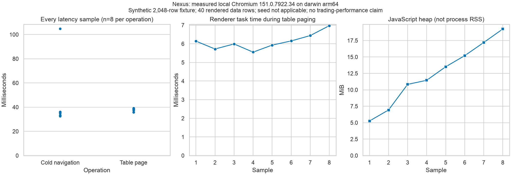

# Signal Foundry Nexus

Nexus is an opt-in local research workstation. It configures the existing isolated
workers and displays their evidence; it does not fit a second implementation in
JavaScript. Every run remains `development_simulation` and `NOT_READY`.

## Launch from a full clone

Follow the root README's three locked Python environment installations and two
package-context commands, then use Node 24:

```bash
npm --prefix apps/nexus ci --ignore-scripts
npm --prefix apps/nexus run build
uv run signal-foundry serve --nexus
```

Open `http://127.0.0.1:8765/nexus`. The same server owns the assets and API. No
development proxy, remote bind, credentials, external font, analytics or broker
control is present. API-only `serve` remains supported. Rebuild after changing
the OpenAPI contract; startup rejects stale, corrupt, extra or symlinked assets.

Select a dataset, model and strategy. Expand the panel, fold, cost and risk
controls, or edit the complete JSON configuration for model hyperparameters,
baseline selection, regime policy and seed. Unsupported optional backends are
disabled with their reason in catalog details. Bundle selection requires an
approved local bundle parent via the global `--bundles` option; inspect its
benchmark and limitations before preflight. Validation remains authoritative for
cross-field and model-specific semantics. Editing invalidates prior validation.

Run only after preflight succeeds. An ambiguous submission freezes its request
and idempotency key; **Retry same submission** retrieves that same job instead of
creating another experiment. Jobs poll serially every two seconds, stopping at a
terminal state, failure or 120 checks. **Refresh jobs** explicitly resumes
monitoring. Cancelling research is a backend job action; closing the browser only
aborts browser requests. Completed jobs expose evidence, globally ordered audit
events and two-run compatibility checks. Incompatible comparisons remain labelled.

Equity/drawdown charts use shared scales, zero references, line patterns and gaps
for missing values. Tables retain all response rows but mount windows of 40 with
keyboard-operable previous/next controls and absolute accessible row indices.
This discrete window avoids scroll-position instability for assistive technology;
it bounds DOM work independently of the API's 2,048-row/table ceiling.
Calibration remains unavailable for regression-only evidence. Hashes are verified
by the server; the browser does not claim to reproduce Python serialization.

## Compatibility and recovery

Both original package trees, CLIs, configs, algorithms and interfaces are intact.
The [parity matrix](nexus-parity.md) identifies features available in Nexus versus
retained legacy applications. Source follow-ups remain open; migration does not
erase their limitations. Never commit from the generated package Git contexts.
Future implementation PRs belong in this unified repository, with qualified links
to original issues. The source repositories remain cloneable and unarchived.

Rollback is additive: launch `serve` without `--nexus`, or revert the reviewed
workstation change. Preserve private research stores and imported source trees.

## Focused qualification

```bash
npm --prefix apps/nexus run format:check
npm --prefix apps/nexus run lint
npm --prefix apps/nexus run build
npm --prefix apps/nexus run test:coverage
npm --prefix apps/nexus audit
cd apps/nexus
npx playwright install chromium
npm run e2e
```

Reviewed visual baselines target Chromium on macOS, including the dedicated
macOS CI job. Other platforms can run the functional/resource specifications;
their raster baselines require separate visual review. No automatic snapshot
update occurs in CI. The root required assembly gate depends on Nexus passing.

The browser checks use [Playwright assertions](https://playwright.dev/docs/test-assertions)
and axe against [WCAG 2.2 criteria](https://www.w3.org/WAI/WCAG22/quickref/), plus
keyboard, viewport, focus and reduced-motion checks. Automated checks and agent
inspection are scoped evidence, not a comprehensive human accessibility audit.

## Recorded local evidence

The [resource samples](evidence/nexus/resources.json) contain eight cold-navigation
and table-interaction measurements with environment and budgets. Renderer task
time is not host CPU; JavaScript heap is separate from the sampled sum of browser
process RSS (shared pages can be counted more than once). Navigation resets HTTP
caching but not operating-system caches. These measurements say nothing about
exchange latency, liquidity or trading capacity. The 2,048-row stress fixture is
synthetic and redistributable. Generate a new sample attachment with
`npm run e2e -- resources.spec.ts`; extract its `resources.json` attachment from
the ignored Playwright JSON report and review before replacing the reference.

```bash
uv run python apps/nexus/scripts/plot-evidence.py \
  docs/evidence/nexus/resources.json /new/path/nexus-resources.png
```



Local validation: 60 focused Python boundary/CLI/API/real-worker integration tests;
38 frontend tests with 92.02% branch coverage; real-worker browser workflow,
axe, four theme/viewport visual goldens, and bounded-table resource checks.
Ten retained AlphaForge dashboard tests and 82 Signalattice console tests passed
in their independent environments. The first dashboard invocation used the root
environment and failed to import scikit-learn; the package environment corrected
that invocation without source edits. Both full source suites were deliberately
not rerun locally. Required remote suites remain enforced. Remote status is
reported on the MR, independently of these local results.

The additional CLI-before-start regression and assembly checks passed together
(77 tests, including overlapping asset cases). Black, Ruff, strict mypy,
contract/workflow drift checks and wheel/sdist builds passed.
