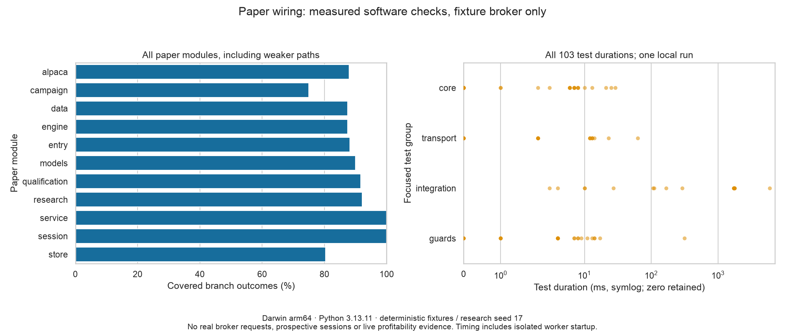

# Paper operations: software evidence and remaining empirical gates

The root 0.3.0 / Nexus 0.4.0 increment wires an explicit paper service while keeping
both imported source trees and independent locks unchanged. It does not include
broker credentials, licensed provider observations, a qualified trading strategy,
real prospective paper sessions or live authority.

## Acceptance evidence

| Implementation #13 outcome | Evidence |
| --- | --- |
| Isolated authority and compatibility | [ADR 0003](adr/0003-bounded-paper-operations.md), fixed-host transport, unchanged assembly trees |
| Intraday provenance and causal diagnostics | `trading/data.py`, `research.py`; immutable-cache, inclusive-end, session/gap, independent P&L oracle, prefix invariance and cost-stress tests |
| Concrete provider/credential contract | `trading/alpaca.py`; fixture HTTPS/account/clock/order/pagination and Keychain policy tests, no real provider calls |
| Durable intent and reconciliation | `trading/store.py`, `engine.py`; post-acceptance timeout, missing intent, repeated partial fills, account/order divergence, restart stop and audit-page tests |
| Formal qualification and risk admission | Actual isolated AlphaForge rubric worker; content/config/plan/expiry tampering, freshness, market/session, notional/loss/order/cadence tests |
| Prospective campaign accounting | Actual-date/official-calendar ledger; missing dates and insufficient elapsed time remain NO_GO |
| Shared CLI and Nexus | Real CLI subprocess and HTTP boundary tests; generated response guards; busy-stop race, same-origin refusal, disabled default, positions and accessible controls |
| Reproducible evidence | Safe measurements below, deterministic Seaborn rendering, inspected desktop/mobile and dark/light browser captures |

The focused Python paper collection is recorded in
[measurements.json](evidence/paper/measurements.json), including every test duration,
per-module branch outcomes, environment and the combined coverage denominator.
Weaker modules remain visible. These are correctness checks; timing includes
worker startup and is not a benchmark or broker/exchange latency measurement.



Reproduce only this slice, without either full preserved source suite:

```bash
uv run python -m foundry_build.paper_evidence --collect
uv run python -m foundry_build.paper_evidence
```

The second command redraws the committed measurements deterministically; the
first creates a new measured local sample. Separate validation includes 137
focused research CLI/API/admission/contract/runner/process/asset regressions,
three evidence-tool checks, strict Python typing/lint/format, generated contract
checks, wheel/sdist builds, and exact source-object/tree verification. The existing
Starlette TestClient/AnyIO alias deprecation warning remains visible.

Nexus component/transport validation: 45 tests, 91.29% branch coverage. Five browser
scenarios exercise real research workers, default unavailable paper HTTP state,
fixture paper positions/stopping, WCAG checks, keyboard/reduced-motion/theme/
viewport behavior and four-series chart distinction. Four existing full-page
reference captures were intentionally updated for the new paper entry button and
accurate footer; all were visually inspected. The paper captures below use clearly
labeled fixture balances, not a real account.

- [Desktop paper panel](evidence/paper/paper-1440.png)
- [Mobile paper panel](evidence/paper/paper-390.png)

Nexus build: 83,176 bytes gzipped JavaScript, 1,712 bytes gzipped CSS, 407,465 total
bytes; existing budgets remain unchanged. Required remote gates are reported on
the implementation/promotion PRs, separately from these local observations.
The pre-existing non-required Signalattice container defect remains tracked as
[Signalattice #67](https://github.com/srgangaram-swe/Signalattice/issues/67).

## Remaining evidence by work item

- **#7:** Real licensed/entitled acquisition, point-in-time universe, revisions,
  corporate actions, symbol history and data acceptance. This adapter deliberately
  retains false completeness flags instead of asserting those properties.
- **#8:** Economic hypothesis, independently reviewed untouched net edge,
  realistic execution/capacity costs and strategy-selection correction. Diagnostic
  code and two candidates are not a profitable strategy.
- **#9:** Credentialed broker contract acceptance and actual paper lifecycle
  evidence, including entitlement/account-specific behavior.
- **#10:** Real operational rehearsals and monitoring evidence across the
  configured account, beyond the software fault-injection tests.
- **#11:** At least 30 scheduled market sessions / 42 calendar days, at least 20
  reconciled flat observations and all other original campaign criteria.
- **#12:** Independent risk/capital checklist and final integration evidence.
  Any future live adapter needs the accepted authorization/architecture process;
  this release does not supply or activate one.

These issues remain open and assigned to the owner. Milestone 2 remains open.
A no-go is a useful outcome when the evidence does not support capital exposure.
