# AlphaForge

AlphaForge is an end-to-end quantitative machine learning research platform for building, validating, and backtesting multi-horizon alpha signals on verified Signal Foundry, public, or synthetic market data.

It is designed to look and behave like a small professional research stack rather than a notebook-only demo: canonical long-format OHLCV data, causal feature engineering, forward labels, embargoed walk-forward validation, out-of-sample prediction panels, signal and portfolio construction, realistic transaction costs, risk analytics, reports, a dashboard, and an API.

AlphaForge is an educational quantitative research and ML engineering project. It is not financial advice, does not guarantee profitability, and should not be used to trade real money without professional review, additional validation, and appropriate risk controls. Backtests are not live results and may not predict future performance.

## What It Demonstrates

- Public market data engineering with yfinance, CSV, and synthetic sources.
- Independent validation of immutable Signalattice bundles: contract version,
  semantic identity, content hashes, temporal availability, license policy, and
  explicit point-in-time limitations, including schema 1.1 historical-universe
  and corporate-action records with fail-closed revision visibility.
- Leak-safe feature engineering on a canonical `(date, symbol, OHLCV)` panel.
- A 2-state Gaussian HMM regime engine (custom Baum-Welch EM) used strictly causally:
  expanding parameter refits + filtered (never smoothed) state probabilities.
- Versioned financial-label contracts spanning regression, classification,
  threshold, quantile, triple-barrier, volatility-scaled, and meta-label
  definitions, with explicit future intervals, holdout protection, dependence,
  balance, stability, and sensitivity diagnostics.
- Explicit train/validation/test/final-holdout plans with rolling or expanding
  histories, session gaps, exact label-interval purging, immutable fold
  identities, and inspectable Seaborn fold evidence.
- Purged K-Fold and Combinatorial Purged CV (CPCV) splitters with exact
  heterogeneous event intervals for overlap-safe evaluation.
- Baselines, linear models, tree models, optional torch models, and governed
  static, rank/vote, temporal-OOF stacking, Bayesian, causal-dynamic, and
  regime-gated ensembles with immutable state and explicit abstention.
- A fail-closed time-frequency progression from LightGBM descriptors to a
  mandatory small CNN, conditional ResNet, and conditional ViT, with
  validation-only tamper-evident gates and aggregate Seaborn evidence.
- A target-free latent-representation boundary spanning raw features, full and
  incremental PCA, robust-scaling PCA, dense/sequence/denoising/variational
  autoencoders, and causal contrastive learning, with train-only fitted state,
  stable identities, bounded optional Torch execution, and validation-only
  selection against the raw control.
- A neural temporal alpha model (dilated causal TCN + attention pooling, composite
  Huber + cross-sectional IC loss) with a real training loop — early stopping on
  validation rank IC, checkpointing, persisted history — via `make train` (ADR 0002).
- Reproducible Seaborn evaluation plots (training curves, IC time
  series/decay, quantile returns, model comparison) rendered with an accessible
  palette and embedded in the report.
- Strict frozen configuration schemas for every supported YAML entry point;
  unknown, unused, unsafe, and cross-field-invalid settings fail before work.
- Versioned, atomic, non-executable JSON Table Schema artifacts replace implicit
  pickle interchange across the local research pipeline.
- Overfitting statistics: Probabilistic and Deflated Sharpe Ratios, Probability of
  Backtest Overfitting (CSCV), and Newey-West IC t-statistics.
- Training-OOF-only Platt/isotonic probability calibration, Brier and
  reliability evidence, dependence-aware moving-block intervals, conservative
  block-conformal residual intervals, and bounded quantile regression.
- A pure cost/uncertainty decision boundary with deterministic identities,
  stable typed abstention reasons, freshness/disagreement/regime/drift gates,
  and no portfolio, order, broker, or network authority.
- Contract-bound predictive, IC, calibration, return, drawdown, turnover,
  exposure, capacity, benchmark, and cost metrics with elapsed-time
  annualization and moving-block sampling distributions.
- A deeply immutable hypothesis and trial-family plan, append-only hash-chained
  research ledger, complete-family Holm/BH corrections, and frozen kill
  criteria that retain failures and rejected evaluation attempts.
- A bounded, content-addressed ten-family Sprint 3 evidence synthesis with
  semantic source locators, an independently verifiable Signalattice receipt,
  aggregate-only Seaborn coverage evidence, and a fail-closed `NOT_READY`
  decision that cannot authorize paper or live execution.
- Backtests that use out-of-sample predictions only.
- Close-decision → next-open execution with a self-financing cash/share ledger,
  drifted holdings, causal lagged-liquidity inputs, partial fills, and reconciled P&L.
- Commission, spread, fixed slippage, square-root impact sensitivity, and capacity
  scenarios — including costed volatility-targeting and drawdown-control trades.
- Portfolio caps, inverse-vol sizing, turnover controls, and regime-aware exposure.
- Immutable causal covariance/factor-risk snapshots, a bounded sparse Markowitz
  QP with independent KKT and objective certification, and reconciled asset,
  factor, specific, realized-P&L, exposure-drift, and scenario attribution.
- Risk metrics, beta-aware stress tests, regime-conditional performance, reporting,
  API endpoints, and paper-trading replay.
- A C++17 limit-order-book execution core with pybind11 bindings, a parity-tested
  pure-Python reference implementation, and reproducible latency benchmarks.
- A pre-registered final-holdout workflow with a hash-chained trial ledger,
  DSR/PBO gates, cost/latency/liquidity/placebo stresses, and an immutable
  machine-readable paper-readiness dossier.
- Fail-closed, zero-capital paper controls with idempotency, stale-data, exposure,
  notional, loss, drawdown, and one-way kill-switch enforcement.

## Architecture

The next repository boundary is documented in the [Signal Foundry preservation ledger](docs/preservation_ledger.md)
and [ADR 0023](docs/adr/0023-lossless-signal-foundry-preservation.md). The exhaustive
pre-import inventory preserves historical provenance and reports migration blockers;
it is not a completed monorepo or a trading-readiness claim.

```mermaid
flowchart LR
    A[Signalattice bundle / public / synthetic] --> B[Validation and quality report]
    B --> C[Leak-safe feature engineering]
    C --> D[Versioned future-event label contracts]
    D --> E[Walk-forward splits with embargo]
    E --> F[Model training and OOS predictions]
    F --> G[Signal construction]
    G --> H[Portfolio construction]
    G -. standalone synthetic study only .-> P[Opt-in cost/uncertainty eligibility research]
    H --> I[Future-open fills + self-financing ledger]
    I --> J[Risk, P&L attribution, and capacity sensitivity]
    J --> K[Report / dashboard / API / paper sim]
```



Signalattice and AlphaForge are separate repositories joined only by the
versioned `signal-foundry-market-data` contract. AlphaForge does not trust
producer code: it independently checks the manifest, every partition hash,
the exact schema, temporal semantics, license policy, adjustment state, and
schema 1.1 universe/action record families before research begins.

## Quickstart

Requires Python 3.12–3.14 and
[uv](https://docs.astral.sh/uv/). The committed lockfile is the supported
dependency resolution; the synthetic demo is offline and does not require
market-data credentials.

```bash
make install
uv run make config-check
uv run make test
uv run make demo
```

The demo is fully offline. It generates synthetic market data, trains a small walk-forward experiment, runs an out-of-sample backtest, and writes a markdown report under `runs/`.

Useful commands:

```bash
make download-data      # yfinance / CSV / synthetic per configs/data.yaml
make build-features     # feature and label panels
make label-evidence OUTPUT=/tmp/alphaforge-label-evidence
make temporal-evidence OUTPUT=/tmp/alphaforge-temporal-evidence
make time-frequency-evidence OUTPUT=/tmp/alphaforge-time-frequency-evidence
make latent-representation-evidence OUTPUT=/tmp/alphaforge-latent-evidence
make ensemble-evidence OUTPUT=/tmp/alphaforge-ensemble-evidence
make decision-policy-evidence OUTPUT=/tmp/alphaforge-decision-policy-evidence
make sprint-3-decision-evidence OUTPUT=/tmp/alphaforge-sprint-3-decision
make walk-forward       # model comparison with OOS predictions
make backtest           # OOS portfolio backtest
make signal-foundry BUNDLE=/absolute/path/to/<bundle-id>
make signal-foundry-evidence RUN=/absolute/run BUNDLE=/absolute/bundle OUTPUT=/new/path
make paper              # simulated paper-trading replay only
make report             # markdown report
make dashboard          # Streamlit dashboard
make api                # FastAPI service
```

The governed Signal Foundry command consumes a local immutable bundle and
writes one content-addressed run under `runs/signal-foundry/`. The committed
rubric in `configs/signal_foundry_research.yaml` separates development-only
model selection from a purged final holdout. Its result can authorize only
zero-capital shadow evaluation; it cannot authorize broker access, orders, or
capital deployment. See [the Signal Foundry operator guide](docs/signal_foundry.md).
The separate `configs/signal_foundry_wiki_bootstrap.yaml` profile fixes a
2017-01-03 holdout before evaluating the stale WIKI engineering bundle. Its
incomplete point-in-time declarations must produce `NOT_READY`.
Every governed run also writes a versioned, content-addressed experiment
manifest. See [Reproducibility and experiment provenance](docs/reproducibility.md)
for the identity, seed, environment, artifact, and credential-redaction
contracts.

The [broker contract and paper adapter](docs/broker_contract_and_paper_adapter.md)
supplies typed, vendor-neutral account, order, fill, position, clock, and quote
records behind a deny-by-default authorization boundary. **No live capability
exists** — it is absent rather than disabled by a flag, endpoints are allowlisted
rather than denylisted, and tests parse the module AST to prove that no override
parameter and no networking import exists. A paper session additionally requires a
`QUALIFIED_FOR_PAPER` decision, which no candidate currently holds, so no session
can be opened. See also
[ADR 0016](docs/adr/0016-deny-by-default-broker-authorization.md).

The [durable session state and reconciliation contract](docs/durable_state_and_reconciliation.md)
makes broker idempotency survive a process restart: intent is persisted before the
broker is contacted, snapshots are atomic and hash-chained, and recovery refuses
tampered, truncated, gapped, schema-incompatible, foreign, stale, or
clock-rolled-back records rather than loading a best guess. Reconciliation against
broker state **halts on any divergence and never repairs or liquidates**, because
an automatic correction acts on exactly the state known to be wrong. See also
[ADR 0017](docs/adr/0017-durable-session-state-and-halt-on-divergence.md).

The [checkpointing and budget contract](docs/checkpointing_and_budgets.md) binds
each checkpoint to the code, data, configuration, dependency set, seed, and task
graph that produced it, so a resumed run cannot silently become a different
experiment wearing the original's name. Budgets are admitted before a batch
starts and enforced while it runs, with no soft or best-effort mode. See also
[ADR 0019](docs/adr/0019-checkpoint-bindings-and-hard-budgets.md).

The [live-readiness framework](docs/live_readiness.md) is the last gate before
capital, and it is designed against the person operating it: no weighted score, no
override parameter anywhere (asserted by parsing the module AST), absence treated
as failure rather than omission, and a content-identified checklist so an edit to
admit a candidate is detectable. Capital configuration is **inert by default** and
has no method capable of raising a cap. **The current verdict is `NOT_READY` with
every one of its seventeen items unmet.** See also
[ADR 0020](docs/adr/0020-live-readiness-gate-and-inert-capital.md).

The [bounded distributed execution contract](docs/distributed_execution.md)
profiles the serial pipeline *before* distributing anything and reports the Amdahl
bound that caps achievable speedup. The reference crossover evidence now retains
one warm-up and seven raw serial/process-pool repetitions at every declared work
size, binds the exact workload, task builder, harness, execution contracts,
dependency lock, and realized task graphs, verifies result membership and output
parity, and reports medians with dispersion. In the current
macOS `spawn` environment every measured process-pool median is slower, including
the largest declared work size, so there is **no observed break-even bracket**.
That result is environment-specific, not a universal threshold or SLA, and keeps
cluster adoption gated. Tasks declare CPU, RAM, GPU, scratch, duration, seed,
timeout, and retry bounds; results assemble by content-addressed identity, never
completion order; and cluster access is never required to reproduce a result.
See [ADR 0018](docs/adr/0018-bounded-distributed-research-execution.md)
and its evidence-method correction in [ADR
0022](docs/adr/0022-content-addressed-sprint-evidence.md).

The [robustness analysis contract](docs/robustness_analysis.md) freezes the
parameter grid, feature ablations, and negative controls, and reports stable
regions rather than a single optimum.
The [temporal, regime, and universe robustness
contract](docs/temporal_regime_robustness.md) extends that to *when*, *under what
conditions*, and *on which securities*: calendar intervals and regime definitions
frozen with content identities, regime labels computed only from strictly-prior
conditioning observations, point-in-time universe membership that refuses a
backfilled constituent list, and block-bootstrap/Newey-West intervals reported
beside the i.i.d. one so the cost of assuming independence is visible. Losing,
sparse, and empty periods are always reported, and portfolio-level dependence
claims are withheld until a candidate is formally qualified.
The [execution perturbation and qualification
contract](docs/perturbation_and_qualification.md) closes Sprint 4: bounded,
frozen Monte Carlo perturbation of order sequence, fill price, signal timing,
missed and delayed trades, size, cost, liquidity, and partial fills, with
insolvent and unreconciled paths kept in the denominator and every path
replayable from its seed coordinates; then a versioned rubric frozen before
scoring, where any failed criterion, missing observation, unevidenced metric, or
reconciliation failure forces `REJECTED`. Sprint 4's own candidate is
**`REJECTED` with 7 of 8 criteria blocking** — see the [Sprint 4
report](docs/sprint_4_report.md). `QUALIFIED_FOR_PAPER` would authorize
zero-capital paper evaluation only; it is never authorization for live capital.
The [borrow, liquidity, and capacity policy](docs/borrow_liquidity_capacity.md)
enforces point-in-time shortability, conserved participation and book budgets,
forced buy-ins, and a complete-rerun capacity frontier.
The [constrained Markowitz optimizer](docs/mean_variance_optimization.md) turns
periodic alpha and immutable point-in-time shrinkage/factor-risk snapshots into
certified feasible weights. Its sparse QP, independent KKT/objective audit,
Euler risk and independently reconciled realized-P&L attribution, and
self-financing synthetic evidence fail closed; they do not advance a strategy
or authorize paper/live trading. The committed [reference
manifest](docs/evidence/signal_foundry_sprint_4/mr2_mean_variance/manifest.json)
and [four-panel Seaborn
figure](docs/evidence/signal_foundry_sprint_4/mr2_mean_variance/mean_variance_evidence.png)
expose failed optimization coverage alongside returns, costs, and input-error
sensitivity so an incomplete arm cannot look complete by omission.
The [ranking portfolio contract](docs/ranking_portfolios.md) defines allocation
policies, the explicit constraint set, uncertainty-aware sizing, and net-of-cost
capacity evidence.
The [regime and change-point contract](docs/regimes.md) defines causal state
models, canonical labelling, and incremental-value evidence against a no-regime
baseline.
The [governed benchmark model contract](docs/governed_benchmark_models.md)
documents the bounded linear, robust, tree, boosting, and small-MLP families,
their deterministic termination evidence, and the remaining barriers to
paper or live use.
The [gated time-frequency vision contract](docs/time_frequency_vision_models.md)
documents Signalattice tensor alignment, train-only normalization,
meaning-preserving perturbations, bounded CNN/ResNet/ViT implementations, and
validation-only progression. Its committed synthetic reference rejected the
small CNN and therefore blocked both larger architectures.
The [latent-representation contract](docs/latent_representations.md) documents
the target-free fit boundary, PCA ambiguity handling, causal sequence
semantics, bounded autoencoders and contrastive encoder, stable state
identities, fixed downstream diagnostics, and aggregate-only evidence. Its
synthetic reference selected PCA on validation but found no test prediction
improvement over raw features.
The [governed ensemble contract](docs/governed_ensembles.md) defines the
complete-date temporal-OOF boundary, target-free holdout inference, six
combination policies, stable state identities, causal audits, explicit
fallback records, and aggregate-only reference evidence. The registry's
historic `ensemble` name remains a compatibility adapter; advanced policies
must use the governed OOF boundary.
The [calibration and uncertainty contract](docs/calibration_uncertainty.md)
documents OOF provenance, mathematical assumptions, deterministic
configuration, JSON-safe persistence, and failure behavior.
The [cost- and uncertainty-aware decision contract](docs/decision_policy.md)
defines conservative value arithmetic, ordered fail-closed reason codes,
stable replay identities, resource limits, and the strict no-order boundary.
The [metric governance contract](docs/metric_governance.md) defines units,
annualization, benchmarks, missingness, invalid states, and dependence-aware
distributions for the unified research scorecard.
The [append-only research governance contract](docs/research_governance.md)
defines frozen hypothesis/lineage plans, trial state transitions, tamper and
truncation detection, complete-family corrections, kill criteria, recovery
behavior, and its external-receipt limitation.
The [governed seven-candidate baseline study](docs/governed_baseline_study.md)
binds that ledger to identical development folds, common costed economics,
matched-fold inference, Holm correction, selected-candidate-only final-holdout
access, and an aggregate-only Seaborn evidence publisher. Its stale WIKI run is
an engineering study, not current market or trading-readiness evidence.

Supply-chain and release controls are documented in
[Release and security governance](docs/release_security.md).
The [Sprint 1 evidence report](docs/sprint_1_report.md) records the final
`NOT_READY` result and its reproducible Seaborn evidence without publishing
licensed rows.
The [Sprint 2 report](docs/sprint_2_report.md) records the governed
seven-candidate comparison, selection correction, costed final-holdout
rejection, compute profile, and aggregate-only Seaborn evidence.
The [Sprint 3 latent-representation report](docs/sprint_3_latent_representation_report.md)
records the nine-candidate synthetic engineering comparison, its mixed/negative
predictive result, transfer and reconstruction diagnostics, compute evidence,
and inspected Seaborn plot.
The [Sprint 3 ensemble report](docs/sprint_3_ensemble_report.md) records the
deterministic synthetic recovery study, correlations, marginal contributions,
turnover/costs, uncertainty, abstentions, and residual market-evidence gap.
The [Sprint 3 MR10 abstention report](docs/sprint_3_abstention_policy_report.md)
publishes the honest synthetic coverage-risk, turnover, capacity,
missed-opportunity, and net-value comparison with always-trade and never-trade.
The [final Sprint 3 report](docs/sprint_3_report.md) preserves the ten
heterogeneous evidence contexts, records five rejected and five deferred
families with zero advanced, and explains why the release remains `NOT_READY`.
Its [governed decision](docs/multi_representation_decision.md),
[aggregate evidence](docs/evidence/signal_foundry_sprint_3/decision/README.md),
and [ADR 0008](docs/adr/0008-context-preserving-sprint-3-synthesis.md) define
the content-addressed provenance and strict evidence-only, no-order boundary.

## Low-Latency Execution Core (C++)

`cpp/` contains a price-time-priority limit order book and synthetic depth-walk
simulator written in C++17 (header-only, no dependencies), exposed to Python via
pybind11 and backed by a pure-Python reference implementation with identical
semantics. Parity tests drive both engines with the same random order flow and
require bit-identical fills, depth, and book state.

Measured on an Apple M-series laptop (`make bench-native`, 2M mixed ops:
55% add / 30% cancel / 15% market):

| metric | value |
|---|---|
| throughput | ~6.2M ops/s |
| latency p50 | ~125 ns |
| latency p99 | ~583 ns |
| pure-Python reference | ~1.1M ops/s |

Honest framing: the daily-bar research pipeline does not need nanosecond
matching and does not fabricate historical L2 books. Historical and paper
replay use the causal daily-bar execution policy above. The native core is a
separate systems demonstration: price-level maps, FIFO queues, O(1) cancel
index, integer-tick determinism, FFI, and cross-implementation testing. It
would require point-in-time L2 data and calibration before serving as a
historical execution model.

```bash
make native        # build the pybind11 extension in-place
make bench         # Python vs C++ comparison (binding overhead included)
make bench-native  # pure C++ benchmark with latency percentiles
```

## Validation Science

Backtest results are only as good as the validation that produced them.
AlphaForge ships the modern anti-overfitting toolkit and wires it into every run:

- **Temporal validation plans** ([contract and mathematics](docs/temporal_validation.md)):
  explicit train, validation, test, purge, embargo, overlap, and inaccessible
  final-holdout roles; interval crossings fail closed on irregular calendars.
- **Purged K-Fold & CPCV** (`alphaforge/training/purged_cv.py`): overlapping
  labels demand exact event-interval purging around every contiguous test block
  plus an embargo; CPCV evaluates all C(n, k) test-group combinations to
  produce many OOS paths instead of one.
- **Deflated Sharpe Ratio** (`alphaforge/evaluation/overfitting.py`): P(true
  Sharpe > 0) after correcting for multiple testing (best-of-N selection),
  sample length, skew, and fat tails. Reported in every backtest summary with
  `n_trials` set to the number of competing model variants.
- **Probability of Backtest Overfitting** (CSCV): how often the in-sample
  winner underperforms the median out-of-sample, computed across models from
  their daily rank-IC panels.
- **Newey-West IC t-statistics**: multi-day labels overlap, so IC series are
  serially correlated; naive t-stats overstate significance.

## Honesty Guarantees

- Every module consumes the same canonical long-format panel.
- Feature functions are causal; tests mutate future data and assert past features do not change.
- Backtests consume only out-of-sample walk-forward predictions.
- Walk-forward splits reject embargo settings shorter than the longest label horizon.
- Execution requires `execution_lag >= 1`; a close-time decision fills no
  earlier than a future open and cannot capture the preceding overnight gap.
- Equity is reconciled to cash plus signed marked holdings every day; weights
  drift between explicit, costed rebalances.
- Typed canonical events bind targets, orders, fills, DAY cancellations, and
  portfolio marks to a frozen calendar. Bounded hash-chained journals support
  idempotent replay; cost-basis accounting exposes realized/unrealized P&L and
  categorized charges without a dollar-sized tolerance floor.
- ADV and volatility used at the open are lagged one full session. Participation
  limits create reported partial fills rather than assumed liquidity.
- Transaction costs are decomposed into commission, exchange fees, half-spread,
  fixed/spread/participation/volatility slippage, power-law impact, financing,
  and short borrow. Immutable declarations, logical-session latency schedules,
  component attribution, and full-rerun adverse stress profiles preserve units,
  provenance, and one accounting path per component. See the
  [market-friction guide](docs/market_frictions_latency.md).

## Repository Map

- `alphaforge/data`: loaders, schema validation, quality reports, synthetic data.
- `alphaforge/features`: technical, cross-sectional, benchmark-relative, and regime features.
- `alphaforge/representations`: typed raw/PCA and optional neural encoders with
  train-only state, causal sequence inputs, reconstruction, and stable identities.
- `alphaforge/labels`: versioned future-event labels and statistical diagnostics.
- `alphaforge/models`: baselines, sklearn/torch wrappers, immutable temporal-OOF
  ensemble contracts and policies, Gaussian HMM regime model, registry.
- `alphaforge/training`: interval-aware temporal plans, walk-forward splitting,
  purged K-Fold, CPCV, and OOS prediction panels.
- `alphaforge/evaluation`: IC analytics, PSR/DSR, PBO, Newey-West inference.
- `alphaforge/decision`: opt-in, standalone cost/uncertainty eligibility and
  abstention evidence; it is not wired into the active portfolio path.
- `alphaforge/signals`: rank, long-short, top-k, threshold, confidence-weighted,
  and regime-filtered signals.
- `alphaforge/portfolio`: capped, inverse-vol, turnover-aware target weights.
- `alphaforge/backtesting`: frozen-calendar event reducer, tamper-evident
  in-memory/SQLite journals, chronological cost-basis ledger, future-open
  simulator, accounting invariants, and P&L attribution.
- `alphaforge/risk`: performance, drawdown, VaR, expected shortfall, regime tables,
  beta-aware stress tests, concentration.
- `alphaforge/execution`: typed orders/fills, causal daily-bar execution,
  bounded friction/carry/latency contracts, and separately scoped Python/C++
  order-book implementations.
- `alphaforge/paper`: simulated replay using the same execution and ledger contract.
- `alphaforge/research`: governed selection, immutable holdout, aggregate
  ensemble evidence, strict cross-repository provenance, content-addressed
  Sprint 3 synthesis, stress, and dossier workflows.
- `cpp/`: C++17 order book, pybind11 bindings, CMake project, native benchmark.
- `scripts`: command-line pipeline entry points.
- `apps`: Streamlit and FastAPI entry points.
- `docs`: methodology, limitations, model card, and career collateral.
- `tests`: leakage, label alignment, split embargo, backtest cost, and pipeline tests.

## Example Output

After `make demo`, inspect:

- `runs/latest_run.txt`
- `model_metrics.csv`
- `panel.table.json` / `features.table.json` / `predictions.table.json`
- `walk_forward_windows.csv`
- `equity_curve.csv`
- `orders.csv` / `fills.csv` / `pnl_attribution.csv`
- `execution_events.csv` / `accounting.csv`
- `friction_model_manifest.csv` / `friction_attribution.csv` / `latency_schedule.csv`
- `capacity_curve.csv` / `capacity_diagnostics.json`
- `backtest_summary.json`
- `report.md`

Results from synthetic data are for engineering verification only. They are not
evidence of live profitability: the generator embeds a deliberately faint but
*clean* edge, so even honest pipelines earn flattering statistics on it. The
interesting outputs are the diagnostics — monotone prediction quantiles, IC
decay curves, Newey-West t-stats, PBO, and the deflated Sharpe — which show the
measurement machinery working.

## License and Changes

Released under the [MIT License](LICENSE). See [CHANGELOG.md](CHANGELOG.md) for
the evolving pre-1.0 research and artifact contracts.
