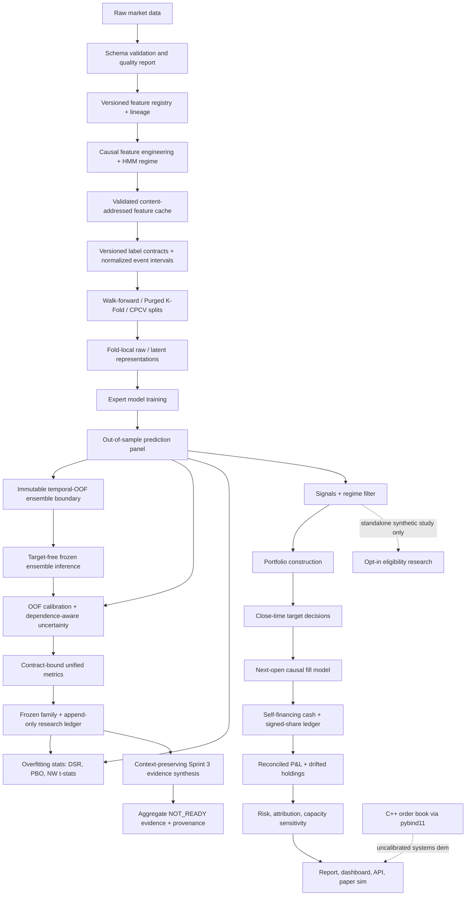

# Architecture

The planned repository consolidation is governed by [ADR 0023](adr/0023-lossless-signal-foundry-preservation.md)
and its [executable preservation ledger](preservation_ledger.md). It does not change
the runtime architecture below or claim completed migration.

AlphaForge is a modular research pipeline:

The central contract is the canonical panel:

`date | symbol | open | high | low | close | volume`

Every downstream module either consumes this panel or a keyed derivative using
`(date, symbol)`. Backtests never train models and never use in-sample
predictions; they consume the saved OOS prediction panel from walk-forward
validation.

Two implementation layers sit beside the Python pipeline:

- **Native execution core** (`cpp/`): C++17 limit order book with pybind11
  bindings and a pure-Python reference implementation kept bit-identical by
  parity tests (docs/execution_engine.md).
- **Historical execution, frictions, and accounting** (`alphaforge/execution/models.py`,
  `alphaforge/execution/frictions.py`,
  `alphaforge/execution/events.py`, `alphaforge/backtesting/event_engine.py`,
  `alphaforge/backtesting/journal.py`, `alphaforge/backtesting/ledger.py`, and
  `alphaforge/backtesting/engine.py`): typed canonical events, a frozen-calendar
  order state machine, tamper-evident in-memory/SQLite journals, lagged-liquidity
  next-open fills, component-level market frictions, logical-session latency,
  native carry accrual, signed shares, cost-basis P&L, categorized charges, and
  fail-closed replay/reconciliation. See [ADR 0001](adr/0001-temporal-integrity.md),
  [ADR 0010](adr/0010-deterministic-event-sourcing-and-accounting.md), and
  [ADR 0011](adr/0011-market-frictions-and-logical-latency.md),
  [the event-driven backtest contract](event_driven_backtesting.md), and
  [the friction-model guide](market_frictions_latency.md).
- **Validation science** (`alphaforge/training/purged_cv.py`,
  `alphaforge/training/temporal_validation.py`,
  `alphaforge/evaluation/overfitting.py`): explicit development and inaccessible
  holdout roles, exact interval-aware purged/combinatorial splitters, immutable
  fold identities, and the PSR/DSR/PBO statistics attached to run evidence.
- **Feature trust boundary** (`alphaforge/features/registry.py`,
  `alphaforge/features/cache.py`, `alphaforge/features/transform.py`): exact
  semantic versions and schemas, content-bound lineage, verified immutable
  cache entries, and learned preprocessing fitted separately inside each
  temporal training fold.
- **Label trust boundary** (`alphaforge/labels/contracts.py`,
  `alphaforge/labels/diagnostics.py`): immutable semantic identities, explicit
  `(t,t+h]` future intervals, protected-boundary rejection, strict price/side
  availability, and dependence/balance/stability/sensitivity evidence. See
  [Financial label contracts and diagnostics](label_design.md).
- **Model governance boundary** (`alphaforge/models/base.py`,
  `alphaforge/models/sklearn_models.py`): typed resource bounds,
  train-fold-only estimator pipelines, explicit optional backends, immutable
  termination evidence, deterministic seed injection, and trusted-only binary
  deserialization. See
  [Governed benchmark models](governed_benchmark_models.md).
- **Representation trust boundary** (`alphaforge/representations/`,
  `alphaforge/research/representation_study.py`): target-free aligned batches,
  train-only normalization and learned state, causal per-symbol windows,
  sign-canonical and subspace-invariant PCA identities, bounded optional Torch
  encoders, explicit reconstruction capability, validation-only selection, and
  aggregate-only atomic evidence. See
  [Leakage-safe latent representations](latent_representations.md) and
  [ADR 0005](adr/0005-leakage-safe-latent-representations.md).
- **Ensemble governance boundary**
  (`alphaforge/models/ensemble_contracts.py`,
  `alphaforge/models/ensemble.py`): complete-date temporal-OOF prediction and
  target contracts, final-holdout exclusion, target-free inference, static,
  rank/vote, ridge-stacking, Bayesian, causal-dynamic, and regime-gated
  policies, stable JSON identities, bounded causal audit records, and explicit
  abstention. See [Governed temporal-OOF ensembles](governed_ensembles.md) and
  [ADR 0006](adr/0006-governed-temporal-oof-ensembles.md).
- **Calibration and uncertainty boundary**
  (`alphaforge/evaluation/calibration.py`,
  `alphaforge/evaluation/uncertainty.py`): training-OOF-only provenance,
  post-fit evaluation periods, strict probability metrics, JSON-safe
  Platt/isotonic state, moving-block bootstrap intervals, conservative
  block-conformal residual intervals, and bounded linear quantile regression.
  See [Calibration and uncertainty contracts](calibration_uncertainty.md).
- **Decision eligibility boundary** (`alphaforge/decision/policy.py`): pure
  immutable expected-value arithmetic; conservative cost and predictive
  uncertainty charges; finite/range/freshness/disagreement/regime/drift gates;
  deterministic IDs and ordered typed reasons; and no quantity, order, broker,
  credential, network, or portfolio state. It is currently opt-in and exercised
  only by its standalone synthetic study; the active signal-to-portfolio path
  does not invoke it. See
  [Cost- and uncertainty-aware decision policy](decision_policy.md).
- **Metric governance boundary** (`alphaforge/evaluation/metric_suite.py`):
  immutable interpretation contracts, explicit undefined states,
  elapsed-calendar-time annualization, benchmark semantics, reconciled
  cost/capacity measures, and deterministic moving-block distributions with
  published variance and assumptions. See
  [Metric governance and time-series distributions](metric_governance.md).
- **Research governance boundary** (`alphaforge/research/governance.py`):
  deeply immutable hypothesis, mechanism, dataset, test, threshold, candidate,
  and lineage plans; a bounded hash-chained trial state machine with an atomic
  head receipt; conservative failed-trial accounting; exact-family Holm/BH
  corrections; and predeclared kill decisions. See
  [Append-only research governance](research_governance.md).
- **Sprint 3 synthesis boundary**
  (`alphaforge/research/sprint_3_decision.py`,
  `alphaforge/research/cross_repository_provenance.py`): strict,
  content-addressed plans and receipts preserve ten heterogeneous evidence
  contexts; bounded semantic locators distinguish reported from missing gates;
  atomic aggregate-only publication emits a `NOT_READY` report, manifest, and
  Seaborn coverage plot. This is an evidence-only leaf with no dependency path
  to signals, portfolios, paper controls, execution, brokers, credentials, or
  capital. See [the final Sprint 3 report](sprint_3_report.md) and
  [ADR 0008](adr/0008-context-preserving-sprint-3-synthesis.md).
- **Governed baseline study** (`alphaforge/research/baseline_study.py`,
  `alphaforge/research/baseline_study_evidence.py`): freezes the exact
  seven-candidate family before execution, binds every trial to the append-only
  ledger, computes matched-fold/multiplicity/economic/calibration aggregates,
  and exposes only non-reconstructive evidence to Seaborn plotting. The
  development runner opens the final holdout only for the selected candidate.
  See [Governed seven-candidate baseline study](governed_baseline_study.md).
- **Capacity evaluation** (`alphaforge/evaluation/capacity.py`): auditable AUM,
  participation, fill-ratio, and cost sensitivities using supplied lagged ADV.
