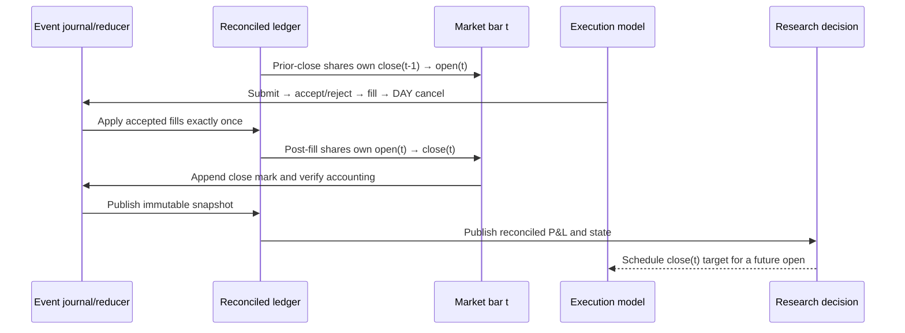

# Backtesting Methodology

AlphaForge uses a chronological, self-financing daily-bar simulator. Saved
out-of-sample predictions produce target weights at a session close; with the
default `execution_lag=1`, the resulting DAY orders fill no earlier than the
next session open.

## Event timeline

This ordering is an invariant, not a naming convention. A target formed with
close(t) information cannot capture the close(t)→open(t+1) gap because it does
not own shares until open(t+1). Tests use a 100→200 overnight gap with a flat
next session to enforce that behavior.

`execution_lag` counts trading sessions rather than calendar days. Target rows
are complete portfolio snapshots: a symbol omitted on a decision date has a
zero target and is liquidated at the next eligible fill. This prevents sparse
panels from silently preserving stale positions.

Every event is bound to the run's frozen, strictly increasing session calendar.
The reducer rejects a mismatched `(session, bar_index)`, a target used before
its exact eligible session, a DAY-order transition that crosses a session, or
a fill whose reference price differs from the current open mark. Content-derived
event identifiers make exact retries idempotent; explicit ordinals, not hash
order, sequence causal fills within one phase.

CLI research runs set `liquidate_at_end=true`: one forced zero target is
scheduled after the final signal/rebalance interval, the book closes at its
future-open fill, and the experiment stops. This prevents the last OOS signal
from becoming an undocumented buy-and-hold position after predictions end.

## Self-financing ledger

The accounting state is signed shares plus cash. Every fill applies

`cash_after = cash_before - signed_shares × fill_price - categorized_fill_fees`

and every close satisfies

`equity = cash + Σ(shares × close)`.

The cost-basis ledger additionally proves at every mark:

`equity = initial_cash + realized P&L + unrealized P&L - total_charges`.

Average cost, realized P&L, unrealized P&L, fees, financing, borrow, other
charges, gross exposure, net exposure, and non-positive-equity state are
explicit snapshot diagnostics. The reducer republishes a fully reconciled
snapshot after every accounting mutation; state-only events preserve that
latest state. All comparisons use operation-count/ULP bounds at the values'
actual scale; there is no dollar-sized absolute tolerance. Non-positive equity
after an open, fill, charge, or close is journaled as an exactly caused
bankruptcy halt and produces no `BacktestResult`.

Shares persist between rebalances. Their weights therefore drift with relative
returns; returning to the same target weights requires a real order, creates
turnover, and pays costs. Long purchases reduce cash, short sales increase
cash, and negative marked position values offset short-sale proceeds.

For each day the engine also verifies

`net P&L = overnight P&L + intraday P&L - execution costs`.

Symbol-level attribution reconciles to the same portfolio totals. Any breach
raises an exception instead of emitting results.

## Causal execution and costs

Daily-bar fills use the next open as their reference price. The model separates:

- commission and exchange fees, debited once through the fill event;
- half-spread, fixed/spread/participation/volatility slippage, and power-law
  impact, embedded once in the fill price; and
- financing and short-borrow carry, debited once after DAY orders terminate
  and before the close mark.

Participation caps use average daily volume shifted one full session before
the fill. The execution-day full volume is never available at the open and is
never used. A DAY order above the configured cap partially fills; its residual
quantity is reported and expires rather than being silently treated as filled.
Missing required open or close prices fail visibly.

Stage-specific data, feature, inference, submission, and fill delays use only
positions on the frozen trading calendar. The full formulas, model identities,
stress profiles, evidence tables, and explicit non-goals are documented in the
[market-friction guide](market_frictions_latency.md).

The impact coefficient is a documented sensitivity, not a fitted claim about
market impact. The C++ order book is likewise an uncalibrated systems component
and is not used to reconstruct historical daily-bar fills.

## Risk overlays

Volatility targeting and drawdown controls are frozen with the close-time
decision using only realized portfolio history through that close. The scale
therefore affects a future fill. Because overlays change requested holdings,
their rebalances pass through the same ledger and cost model as every other
trade. Drawdown control uses the realized controlled equity path, including
feedback from earlier interventions.

## Capacity sensitivity

The capacity curve scales observed desired/fill notionals across explicit AUM
scenarios, caps each row by caller-supplied lagged ADV, and applies a transparent
power-law cost sensitivity. It returns both aggregate and row-level tables so
each point reconciles. These are scenario sensitivities—not deployable-AUM
forecasts, guarantees, or a substitute for calibrated order-level data.

## Artifacts

Each completed backtest writes:

- `equity_curve.csv`: cash, equity, market P&L, cost, returns, turnover, and exposures;
- `orders.csv` / `fills.csv`: decision and fill dates, quantities, prices, liquidity,
  participation, residuals, and cost components;
- `executed_weights.csv`: signed shares, marked values, drifted weights, and targets;
- `pnl_attribution.csv`: overnight/intraday market P&L and costs by symbol;
- `execution_events.csv`: identifiers, logical coordinates, types, and causation
  only (no prices or raw signal values);
- `accounting.csv`: realized/unrealized P&L, categorized charges, gross/net
  exposure, equity, and reconciliation diagnostics at every close;
- `friction_model_manifest.csv`: resolved units, bounds, provenance, limitations,
  parameters, and model/configuration identities;
- `friction_attribution.csv`: normalized fill, rejection, financing, and
  per-symbol borrow evidence;
- `latency_schedule.csv`: causal logical-session stages and schedule identities;
- `capacity_curve.csv` / `capacity_scenarios.csv`: aggregate and row-level sensitivities;
- `capacity_diagnostics.json`: data provenance and interpretation guardrails.

`run_backtest(..., event_journal=...)` accepts an empty caller-owned journal;
`SQLiteJournal` provides verified local restart when explicitly requested.
Canonical journal payloads contain the price marks required for replay and may
therefore contain licensed observations. They belong only under ignored,
owner-controlled run storage and are never automatic public evidence. The
returned `events` table is deliberately metadata-only.

Performance metrics start with the first non-zero exposure. Sharpe and Sortino
use arithmetic daily means annualized by √252; annual return is geometric.
Deflated Sharpe uses the number of model variants visible to the run, while the
limitations document states why that cannot account for uncoded experiments.

## Beyond the backtest

A backtest is not an execution record. The
[broker connectivity requirements](broker_connectivity_requirements.md) state
what a broker must supply before any of this reaches a paper environment — the
capability matrix, failure-mode behaviour, reconciliation cadence, idempotency
requirements, and the nine-item capital-authorization gate. None of the nine
items is currently satisfied, and no broker client or connection exists.
