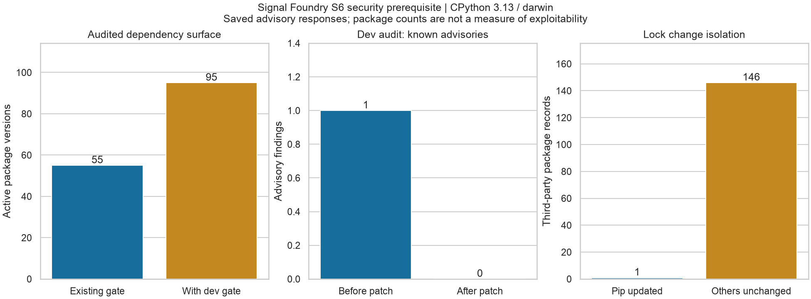

# Development-tool dependency audit

Issue [#123](https://github.com/srgangaram-swe/AlphaForge/issues/123) is a security
prerequisite for the unified repository import in #79. The previous security
job installed development tools but audited only runtime/data/ML requirements.
That excluded pip, reached through `pip-audit -> pip-api -> pip`.

The lock now pins pip **26.2**, equivalent to **26.2.0** under PEP 440, and the
dev extra enforces the patched minimum. The direct `packaging` declaration
makes the verifier's parser dependency explicit; its locked version stays 26.2.
All 146 other third-party package records, including versions, markers, artifact
hashes, and URLs, are identical to baseline commit
`c9371ef4c9edd0a148b751b17b4b939d8905d300`. Runtime requirements are unchanged.

## Measured audit surface

The saved CPython 3.13/macOS audit responses show one known pip advisory before
the patch and none after. The old requirements were queried using the patched
audit tool with dependency resolution disabled; vulnerable pip was not installed.
The existing runtime/data/ML audit also passed separately.

| Surface | Active package versions on this host |
| --- | ---: |
| Existing runtime/data/ML gate | 55 |
| New runtime/development gate | 78 |
| Newly covered development-only versions | 40 |
| Union of both gates | 95 |



The figure was generated through Seaborn and visually inspected. Its
[machine-readable inputs](evidence/signal_foundry_sprint_6/dev_audit/evidence.json)
bind both locks, the export, and saved advisory responses by SHA-256.
The [manifest](evidence/signal_foundry_sprint_6/dev_audit/manifest.json) hashes the
published JSON and PNG. Counts are exact for the recorded host, not uncertainty
estimates, vulnerability probabilities, or evidence of production readiness.

## Gate and algorithm

The existing required `dependency-audit` job gains three steps; its original
runtime/data/ML audit, timeout, permissions, and Action pins are retained:

1. Export runtime plus the **dev extra** with `uv export --locked --no-dev
   --extra dev`. `--no-dev` disables the uv development *group*, not the
   explicitly selected project *extra*. No project, header, annotation, URL,
   unpinned dependency, or hash removal is accepted by the verifier.
2. Validate every exported pin and its complete artifact-hash set against
   `uv.lock`. Compare active pins with the full runtime/dev dependency closure.
   Install the validated requirements into a new environment using only
   hash-checked binary distributions from the public PyPI index.
3. Run `pip-audit --strict --require-hashes --disable-pip` on that file. This
   queries known advisories without invoking another resolver or building an
   sdist. A missing/skipped package, audit failure, or advisory fails the job.

`scripts/dev_audit.py` is an independent verifier of uv's solved graph, not a
replacement dependency solver. Its iterative worklist tracks `(package, extra)`
visits so cycles terminate and later-requested extras are not lost at diamonds.
Versioned edges and resolution markers disambiguate forks. Traversal is linear
in visited nodes/edges for this lock's unique versions; version forks additionally
scan the indexed candidates for that package name. Final reports sort pins for
deterministic output. Active-name membership uses a hash set.

Input is capped at four MiB per file, 2,048 package/export records, 32,768 edges,
4,096-character markers, and 128-character versions. The Linux/macOS file reader
uses no-follow/nonblocking opens and checks the opened descriptor is a regular
file. Marker-selection tests cover Python 3.12–3.14 on Linux, macOS, and Windows;
they are not Windows execution tests. CLI failures have stable, redacted codes
and exit 2. Network calls have a 15-second request timeout inside the unchanged
15-minute CI job deadline.

## Reproduce the development gate

Use committed uv 0.11.28 and a supported Python from the repository root:

```bash
uv sync --locked --extra dev --extra data --extra ml
uv export --locked --no-dev --extra dev --no-emit-project \
  --no-header --no-annotate --format requirements-txt \
  --output-file /tmp/alphaforge-dev-requirements.txt
uv run --no-sync python -m scripts.dev_audit /tmp/alphaforge-dev-requirements.txt
uv venv /tmp/alphaforge-clean-dev-audit
uv --no-config pip sync --python /tmp/alphaforge-clean-dev-audit/bin/python \
  --default-index https://pypi.org/simple --require-hashes --only-binary :all: \
  /tmp/alphaforge-dev-requirements.txt
/tmp/alphaforge-clean-dev-audit/bin/python -m pip_audit \
  --strict --require-hashes --disable-pip --vulnerability-service pypi \
  --timeout 15 --progress-spinner=off \
  --requirement /tmp/alphaforge-dev-requirements.txt
```

Choose new temporary paths on repeat runs. For saved evidence, add
`--format json --output <response.json>` to each audit. Export the before pins
from a detached checkout of the baseline using the current uv tool and
`--frozen`; **do not install that old toolchain**. Query the before file with
the patched audit Python and expect a nonzero result when an advisory exists.
Publish a new evidence directory with:

```bash
uv run --no-sync python -m scripts.dev_audit_evidence \
  --before-lock <baseline-checkout>/uv.lock --after-lock uv.lock \
  --requirements /tmp/alphaforge-dev-requirements.txt \
  --before-audit <before-response.json> --after-audit <after-response.json> \
  --output <new-evidence-directory>
```

The publisher rejects missing/duplicated/skipped package results, current
advisories, unrelated lock drift, and existing destinations. It exports only
package metadata, advisory identifiers, counts, and hashes, not service prose,
credentials, source packages, or market data. A sibling reservation coordinates
compliant writers; staging and rename publish complete results. This assumes
a trusted local parent directory, not an adversarial concurrent filesystem.
Repeatability tests compare both complete JSON and PNG bytes for fixed inputs.
Fresh advisory queries can change as the database changes.

## Limits, provenance, and rollback

The advisory affects handling of malicious package-index URLs. See the
[upstream advisory](https://github.com/advisories/GHSA-qwm4-qh6w-59xr) for its
exploit conditions; package-count growth is not a quantitative reduction in risk.
Hash checking binds approved artifacts but cannot establish that reviewed code
or a trusted package is harmless. The validator checks the active host closure;
inactive marker records retain hash validation but are not claimed audited here.
The app/torch extras, native system libraries, Action internals, build-isolation
tools, and pre-commit's separate environments are not newly covered by this gate.
Their existing checks remain in force.

The preservation ledger and prior sprint artifacts remain byte-identical.
The first full CI run exposed a stale Sprint 5 test input: its historical timing
record correctly failed the publisher's current-lock hash check after this
dependency update. Publication tests now measure a tiny real serial/process-pool
benchmark once per module under the current lock, then reuse that immutable
snapshot for byte-repeatability and fault-injection assertions. A regression
test explicitly rejects relabeling the archived timings as a current-lock run.
No historical timing, hash, production verifier, or acceptance threshold changes.
The next source import must re-freeze and review this source/lock advancement;
old ledger bindings are historical records, not silently updated approvals.
The four historical missing-license findings still require the explicit owner
determination in ADR 0023. This MR neither imports source nor closes that gate.

Rollback is a reviewed revert through `dev`. Reverting the pip patch restores
the advisory and must not be represented as a security repair. The default-branch
Dependabot alert remains open until checked forward promotion updates `main`.

Primary tool contracts: [uv export](https://docs.astral.sh/uv/reference/cli/#uv-export)
and [pip-audit](https://github.com/pypa/pip-audit).
