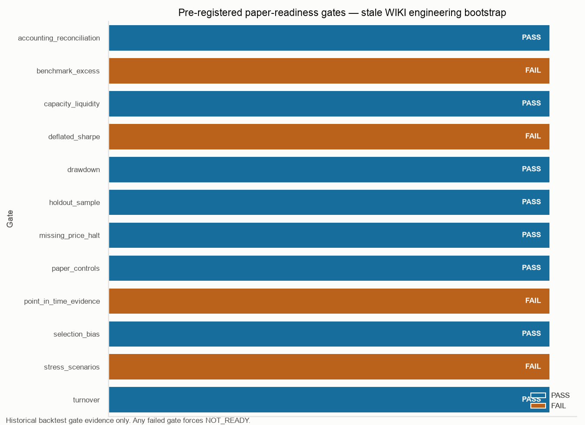
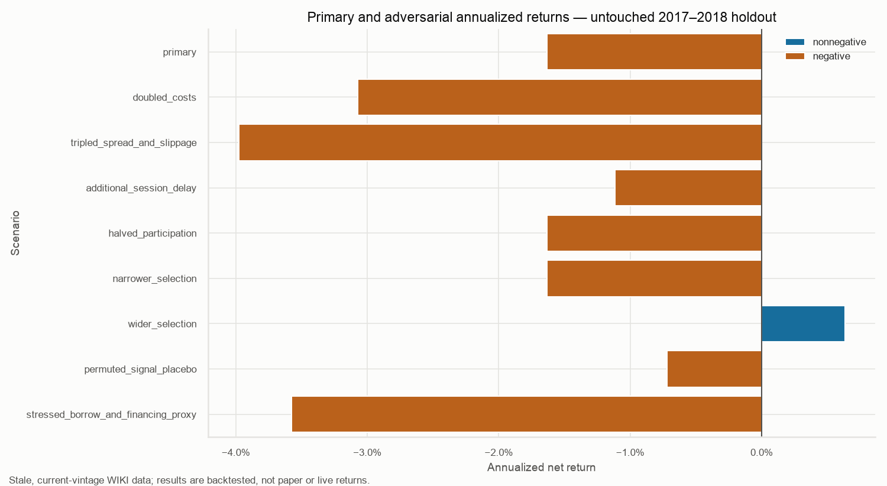
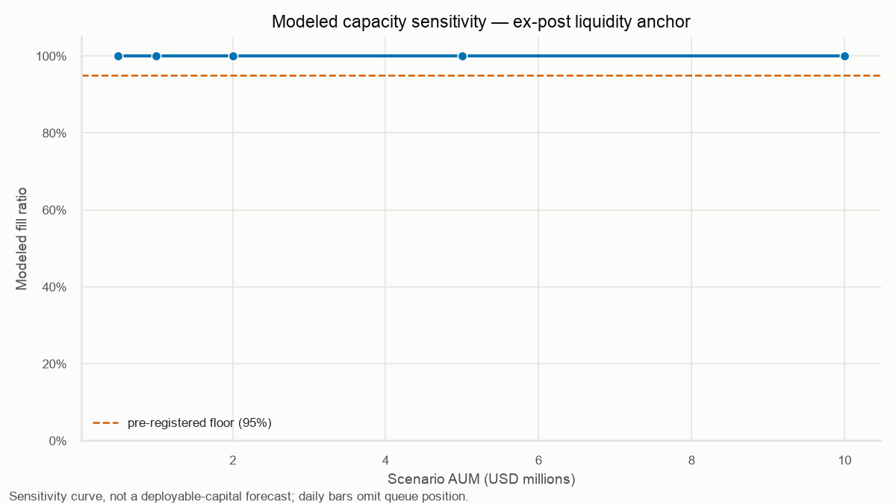

# Signal Foundry Sprint 1 evidence

Decision: **NOT_READY**.

This is redistribution-safe aggregate evidence from the stale Nasdaq WIKI engineering bootstrap. It validates the governed historical research path; it is not paper-trading or live-trading evidence and is not a profit claim.

See `summary.json` for provenance, failed gates, and limitations. The licensed bundle and all row-level run artifacts remain outside Git.
