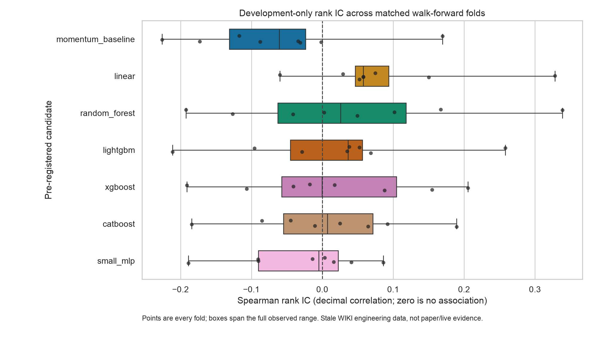
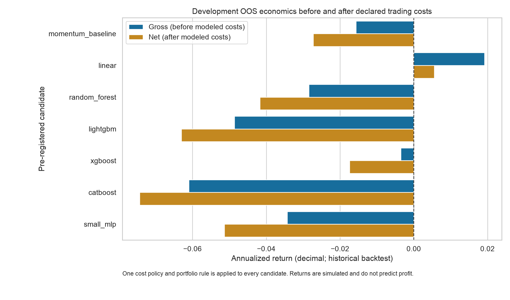
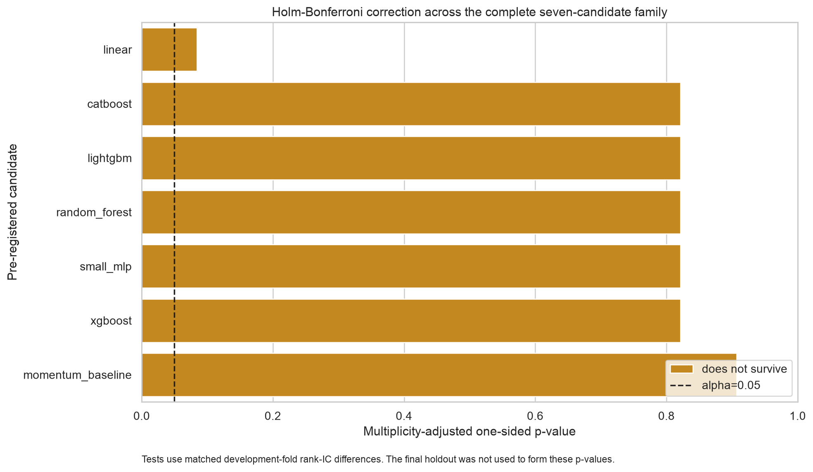
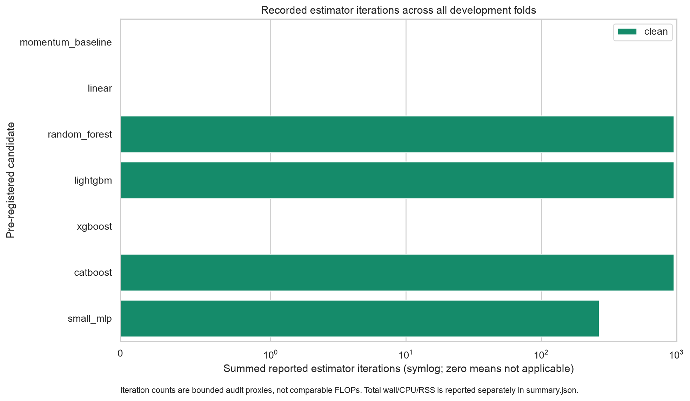

# Signal Foundry Sprint 2 evidence

Decision: **REJECT_PAPER_ADVANCEMENT**. Selected development candidate: `linear`.

This evidence is an aggregate historical study on the stale Nasdaq WIKI engineering bootstrap. It is not paper trading, live trading, a current market forecast, or a profit claim. The final holdout and every row-level observation, prediction, order, fill, position, and return remain outside Git.

See `summary.json`, `fold_metrics.csv`, and `model_summary.csv` for the machine-readable evidence, provenance, decision gates, and limitations.
