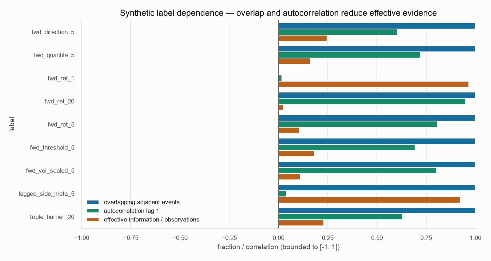
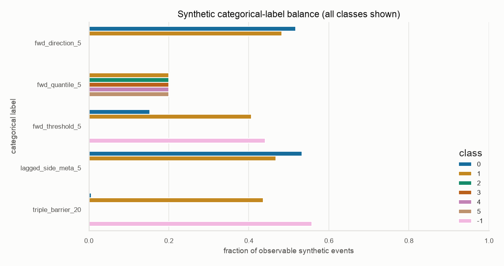
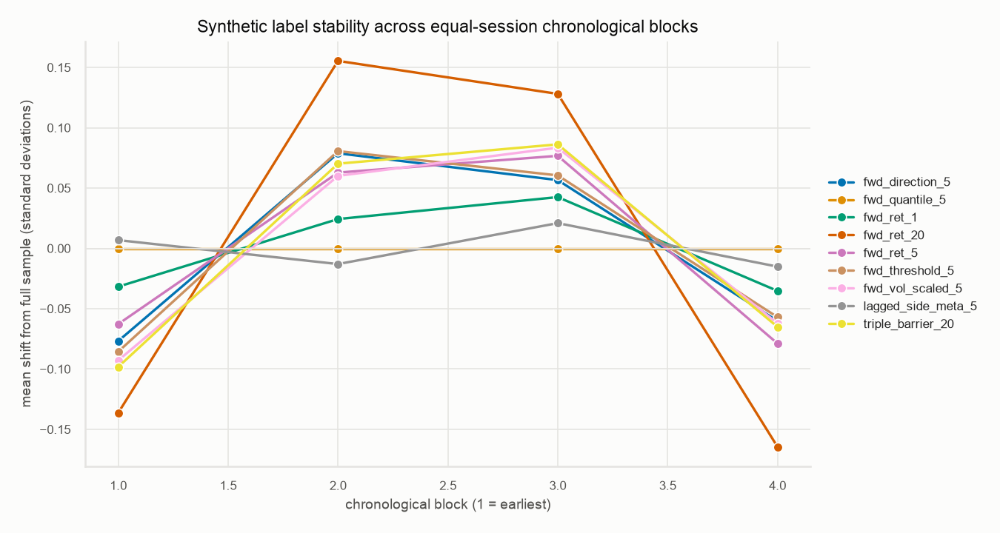
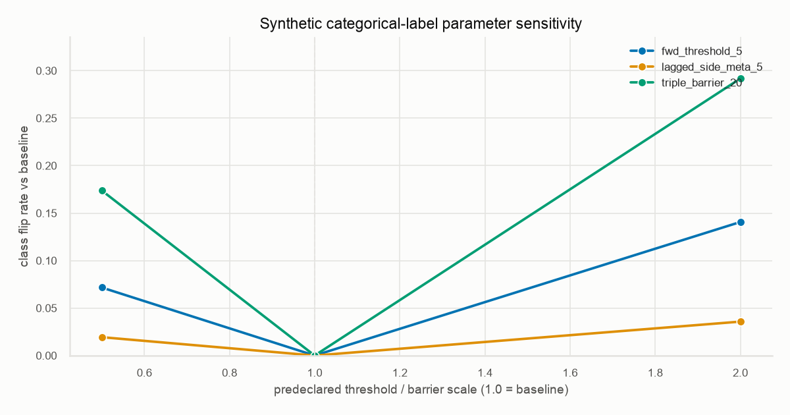

# Financial label contracts and diagnostics

AlphaForge treats a label as a versioned future-event contract, not merely a
column name. The governed boundary in `alphaforge.labels.contracts` materializes
an immutable `LabelContract` into a `LabelDataset` with two tables:

- `values`: one configured target column per `(date, symbol)`; and
- `events`: one normalized record per label observation with the label identity,
  timing convention, required future start, required future end, and
  observability state.

The original `build_labels` helper remains available so historical experiments
are not silently reinterpreted. New governed materialization uses
`build_label_set` and the strict [`configs/labels.yaml`](../configs/labels.yaml)
schema. This is an explicit migration boundary, not an in-place semantic change.

## Timing and mathematical contracts

All schema `1.0.0` definitions use adjusted close-to-close timing. A label
recorded at session \(t\) is unknown at \(t\) and requires the half-open/closed
future interval \((t,t+h]\), ending at the close of the \(h\)-th subsequent
observed session. Features used to predict that label must be available no later
than \(t\); temporal validation must purge intersecting event intervals and
apply an embargo at least as long as the maximum horizon.

For adjusted close \(P_t\), the configured families are:

- **Regression:** \(y_t=P_{t+h}/P_t-1\).
- **Classification:** \(y_t=\mathbb{1}[P_{t+h}/P_t-1>0]\).
- **Threshold:** \(y_t\in\{-1,0,1\}\), using predeclared symmetric return
  threshold \(\tau\).
- **Cross-sectional quantile:** deterministic same-date bins of the forward
  return, numbered \(1,\ldots,q\). At least \(q\) eligible symbols are required.
  Symbol ordering breaks exact return ties deterministically.
- **Triple barrier:** the class is \(1\) when a close first reaches the positive
  barrier, \(-1\) when it first reaches the negative barrier, and \(0\) when
  neither close reaches a barrier before the vertical horizon. This daily-close
  definition makes no unsupported claim about intraday barrier ordering.
- **Volatility scaled:** the forward return divided by
  \(\hat{\sigma}_{t,w}\sqrt{h}\), where \(\hat{\sigma}_{t,w}\) is the trailing
  sample standard deviation of one-session returns through \(t\). Zero or
  insufficient trailing volatility yields a missing target rather than
  infinity.
- **Meta-label:** \(\mathbb{1}[s_t(P_{t+h}/P_t-1)>\tau]\), where the primary side
  \(s_t\in\{-1,1\}\) is either an explicitly validated input column or the
  causal sign of the preceding close-to-close return. A meta-label measures
  whether a pre-existing side was correct; it does not create a position side
  from its own future outcome.

Every definition records its version, kind, name, horizon, timing, price field,
overlap policy, normalized parameters, required interval convention, and
SHA-256 semantic identity. Changing any semantic field creates a different
identity. The enclosing contract identity also binds the benchmark, ordered
definitions, missing-price policy, and protected temporal boundaries.

## Fail-closed trust boundary

Market data is untrusted. Before materialization, the governed boundary rejects:

- absent required columns or benchmark, duplicate keys, invalid dates, untrimmed
  symbols, non-finite/non-positive closes, and insufficient history;
- a missing benchmark-calendar close inside any symbol's active interval;
- invalid thresholds, quantile counts, volatility windows, barriers, sides,
  names, horizons, versions, timing conventions, or undeclared parameters;
- a horizon that overflows the available history; and
- any observable event beginning before and ending on or after a configured
  protected boundary.

Label calculations are performed independently per symbol. Only the explicitly
declared quantile family performs a same-date cross-sectional operation. A
mutation test proves that changing one asset cannot alter another asset's
non-cross-sectional labels. The current strict contract has no imputation or
silent next-observation fallback: an unavailable close fails publication.
Resource use is bounded to 64 definitions, 10 million input rows, 50 million
materialized label cells, and 50 million triple-barrier path evaluations per
request; requests beyond those limits fail before allocation or path scanning.

The overlap policy is part of each definition. `allow` retains every observable
event and delegates purging to temporal validation. `non_overlapping` retains
deterministic horizon-spaced events per symbol. Choosing a policy changes the
definition identity and therefore the research identity.

## Diagnostics and interpretation

`diagnose_labels` reports four machine-readable evidence tables:

- **summary:** missing fraction, adjacent-event overlap, configured-lag
  autocorrelation, autocorrelation pair count, effective sample size, mean, and
  standard deviation;
- **class balance:** counts and fractions for every observed categorical class;
- **temporal stability:** counts, means, and standard deviations in equal-session
  chronological blocks; and
- **parameter sensitivity:** correlation, mean absolute change, and categorical
  flip rate under predeclared magnitude scales.

The effective sample size is the bounded AR(1) approximation

\[
n_{\mathrm{eff}} =
\operatorname{clip}\left(
n\frac{1-\rho_1}{1+\rho_1}, 1, n
\right).
\]

It is a dependence diagnostic, not a universal correction or a substitute for
purged validation. Parameter sensitivity scales thresholds and barrier
magnitudes uniformly; it does not optimize them. Regression, classification,
quantile, and volatility-scaled definitions without magnitude parameters retain
the same identity and are omitted from perturbed sensitivity curves.

## Reproducible synthetic evidence

The committed reference evidence is generated from 756 deterministic synthetic
sessions, ten tradable symbols, and seed `20260725`. It contains no credential,
provider response, licensed observation, final-holdout result, or market
performance claim.

Generate an independent immutable copy into a new directory:

```bash
make label-evidence OUTPUT=/tmp/alphaforge-label-evidence
```

The command validates `configs/labels.yaml`, builds the baseline and predeclared
`0.5x`, `1.0x`, and `2.0x` magnitude variants, writes CSV evidence, renders all
plots through Seaborn with the colorblind theme, records file hashes, and
refuses to overwrite an existing destination. The committed manifest and
tables are under [`docs/evidence/label_diagnostics`](evidence/label_diagnostics).



The high overlap for multi-session labels is expected and shows why row count
is not independent evidence. A one-session return has no overlapping return
interval under the explicit \((t,t+h]\) convention.



All classes are shown. Imbalance is a property to model and report, not hide
behind aggregate accuracy.



Period means are shown as deviations from the full synthetic sample mean in
units of that label's full-sample standard deviation, making different native
units comparable without implying market stability.



The sensitivity curve reports class flips relative to the baseline. It exposes
fragility; it is not evidence that any setting is economically useful.

## Security, rollback, and limitations

No provider credential or observation enters the reference generator. Evidence
publication is local, bounded, transactional at the directory boundary, and
refuses overwrite. CSV and JSON are non-executable; PNGs are derived only from
their committed synthetic aggregates. Real or licensed observations and their
generated label panels belong under ignored local storage and must retain the
upstream bundle identity and limitations.

The new path is configuration-gated. Rollback removes its configuration and
materialization call while preserving the legacy helper and the last verified
label artifacts. Never downgrade a contract version or bypass a rejection to
reuse an incompatible target.

These controls establish semantics and prevent several classes of temporal
error. They do not make a label predictive, point-in-time market data complete,
or a strategy profitable. Quantile labels still depend on the eligible
cross-section; the current free WIKI bootstrap is stale and lacks proven
point-in-time membership; daily closes cannot resolve intraday triple-barrier
ordering; autocorrelation-based effective sample size is approximate; and
synthetic balance, stability, or sensitivity is engineering evidence only. The
final holdout remains inaccessible until candidate and evaluation policy are
frozen.
