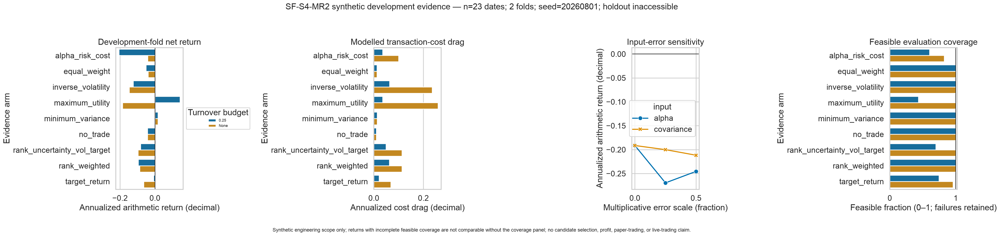

# Certified point-in-time portfolio optimization (SF-S4-MR2)

AlphaForge provides simulation-only infrastructure for causal risk estimation,
constrained Markowitz allocation, and reconciled risk attribution. It does not
claim that an efficient frontier is stable, that a historical allocation is
profitable, or that any strategy is ready for paper or live trading.

Sprint 3 deliberately concluded `Advance = 0` / `NOT_READY`. No approved
prediction candidate therefore exists for this component to consume. MR2 is
bounded to infrastructure and redistribution-safe synthetic evidence; issue #44
owns the later frozen qualification decision. The final holdout is not exposed
to the MR2 comparison API or reference study.

## Point-in-time risk snapshot

`RiskModel` is an immutable covariance contract in squared periodic-return
units. It carries:

- exact asset order, periods per year, estimator identifier and parameters;
- strict `as_of` semantics and the actual observation start/end interval;
- considered, complete, and dropped observation counts and dropped assets;
- an exact SHA-256 source digest and a separate model identity;
- minimum eigenvalue, condition number, shrinkage intensity, and any explicitly
  permitted round-off-scale ridge.

Point-in-time estimator observations end strictly before `as_of`. Omitting
`as_of` from the covariance estimator explicitly requests an offline batch over
the supplied observations; it does not create a decision-ready snapshot. A
future-mutation test changes every observation later than a declared decision
and requires the earlier covariance and identity to remain byte-for-byte
unchanged. Materially indefinite, singular, or ill-conditioned inputs are
refused; stabilization cannot silently turn a different matrix into the
requested strategy. Input is bounded before sorting or numeric conversion at
100,000 rows, 2,000 assets, and 2,000,000 cells; estimator windows are bounded at
10,000 observations. A name with no observation inside the actual trailing
window is dropped and reported as stale instead of borrowing older history or
erasing coverage loss.

`estimate_factor_risk_model` fits the point-in-time linear decomposition

```text
Sigma = B F B' + D
```

where `B` is the supplied exposure vintage, `F` is a shrunk factor covariance,
and `D` contains positive specific variances. The public `FactorRiskModel`
reconstructs the asset covariance on construction and rejects a mismatch. The
estimator requires both the exposure vintage and its availability timestamp,
enforces `exposure_vintage <= exposure_available_at <= as_of`, and binds those
timestamps and the exact supplied matrix into source and model identities. This
proves the declared temporal contract; upstream data governance must still prove
that the declaration itself is truthful. Factor count is capped at 64. Exposure
rank and conditioning are checked directly, and factor/specific floors report
their threshold, adjustment, and affected count. If stabilization is needed
while its corresponding shrinkage setting is zero, estimation fails rather than
silently changing the model.

## Optimization problem

All expected returns are periodic returns at the same frequency as the risk
model. Risk aversion therefore has inverse-return units. Alpha availability may
not be later than the decision timestamp, and a point-in-time risk snapshot must
share that decision boundary.

For weights `w`, previous holdings `p`, covariance `Sigma`, alpha `mu`, and
risk-aversion coefficient `lambda`, the cost-aware formulation is:

```text
minimize  (lambda / 2) w' Sigma w - mu'w
          + c1 ||w - p||_1 + c2 ||w - p||_2^2
```

The other formulations use the same canonical contract:

| Formulation | Objective / additional constraint |
|---|---|
| `minimum_variance` | minimize `0.5 w'Sigma w`; a budget equality is required |
| `target_return` | minimize `0.5 w'Sigma w` subject to `mu'w >= target` |
| `maximum_utility` | minimize `(lambda/2) w'Sigma w - mu'w` |
| `alpha_risk_cost` | maximum utility plus linear and quadratic turnover cost |

Configured limits cover the budget equality, gross and leverage ceilings, net
exposure, long-only policy, per-position and liquidity caps, full-universe
turnover, and bounded sector/factor exposures. A name leaving the investable
universe is a mandatory liquidation: its turnover and linear/quadratic costs are
charged rather than disappearing during reindexing.

Absolute gross weights and trades are represented with epigraph variables, so
the problem is one canonical sparse convex QP. The locked Apache-2.0 OSQP
dependency solves that QP; [ADR 0009](adr/0009-certified-sparse-mean-variance-qp.md)
records the dependency, alternatives, numerical policy, rollback, and residual
risk.

The solve boundary accepts at most 512 assets, 256 exposure constraints, 1,024
previous-book names, 20,000 iterations, and five solver seconds. A nonzero
budget at or below the float64 audit floor (`128 * eps`) is refused: an absolute
certificate floor could otherwise mistake a zero book for that budget. When the
largest absolute quadratic or linear objective coefficient is below `1e-2`, the
entire objective—including its constant—is scaled together before OSQP sees it.
This preserves the optimizer while preventing a small-return-unit objective from
being treated as numerically flat; the policy is included in solve identity.

## Independent result certificate

A solver success string is never sufficient. A result becomes `optimal` only
when the exact supported OSQP status and every independent check pass:

- original financial constraints recomputed from weights, including exited
  holdings;
- QP primal feasibility under an absolute row-residual check;
- scale-normalized KKT stationarity and complementarity;
- independently reconstructed formulation-specific objective components;
- relative objective-reconstruction and primal/dual-gap checks; and
- finite, aligned, immutable returned weights and diagnostics.

The certificate intentionally uses a mixed policy rather than pretending unlike
units are interchangeable. Canonical QP row violation is an absolute residual in
the submitted row's units and must not exceed `1e-7`. Stationarity,
complementarity, objective reconstruction, and primal/dual gap are normalized by
their implemented vector or objective scales; objective reconstruction uses
`1e-8`, and the other KKT checks use `1e-7`. The reported maximum residual is
therefore a conservative diagnostic across unlike checks, not one universal
dimensionless error measure. The separate financial audit uses scale-aware
constraint tolerances with a fixed round-off floor.

Inaccurate success, iteration exhaustion, timeout, infeasibility, malformed
input, excessive dimensions, or a failed certificate remains non-tradable. The
evidence consumer accepts only `status == "optimal"` with a passing audit.
Solver identity hashes exact input bytes, timestamps, formulation, dependency
version, iteration/tolerance settings, and deterministic configuration; inputs
are never rounded before hashing.

## Risk and P&L attribution

`attribute_ex_ante_risk` reports Euler marginal and component asset risk. For
portfolio volatility `sigma_p`:

```text
marginal variance_i  = (Sigma w)_i
component variance_i = w_i (Sigma w)_i
component vol_i      = component variance_i / sigma_p
```

Components must reconcile to portfolio variance and volatility before the
record is returned. A factor snapshot additionally reports factor exposures,
factor risk, per-asset specific risk, and exact factor-plus-specific
reconciliation.

The attribution module also provides:

- per-asset realized return and currency-P&L contributions against an ending
  equity value supplied independently by the caller, with explicit starting
  cash weight, cash return, and aggregate cost;
- pre/post-return asset, cash, gross/net, and factor-exposure drift under a
  self-financing ledger; and
- a bounded, deterministically ordered set of named modeled return scenarios
  with explicit cash/cost paths and per-asset return, P&L, and ending-value
  reconciliation.

Realized attribution refuses the record unless both contribution sums and a
separately constructed ending-value path reproduce the observed ending equity.
Scenario outputs are counterfactual model calculations: they reconcile their own
return, P&L, and ending-value paths, but they have no independent observed
endpoint and are never labelled realized evidence.

These are return-series diagnostics, not order-, fill-, broker-, tax-, or
financing-level execution attribution. The event-driven execution work owns
those later boundaries.

## Reference evidence

The strict study configuration is
[`configs/mean_variance_study.yaml`](../configs/mean_variance_study.yaml). The
publisher uses a fixed seed and synthetic data, excludes its protected holdout
from all comparison objects, and atomically writes a new directory containing:

- fold/regime/capital/turnover comparisons for every Markowitz formulation;
- equal-weight, inverse-volatility, rank-based, uncertainty/volatility-target,
  and drifting no-trade baselines on identical dates;
- alpha and covariance-error sensitivity;
- annualized return/volatility, drawdown, turnover, cost, VaR/CVaR/worst bar,
  concentration/effective-N, exposure, coverage, conditioning, failure, and
  certificate diagnostics;
- dependence-aware uncertainty for the mean; and
- a four-panel Seaborn figure covering net returns, modeled cost drag,
  alpha/covariance input-error sensitivity, and feasible evaluation coverage;
  plus configuration identity, artifact hashes, and explicit limitations.

The fourth panel is a required interpretation guard: solver failures remain in
the denominator, so the return of a low-coverage constrained arm cannot be read
as comparable to a fully evaluated baseline. The committed artifacts trace the
reference plot to machine-readable inputs and identities:

- [manifest](evidence/signal_foundry_sprint_4/mr2_mean_variance/manifest.json);
- [scope and identity summary](evidence/signal_foundry_sprint_4/mr2_mean_variance/summary.json);
- [aggregate comparison](evidence/signal_foundry_sprint_4/mr2_mean_variance/comparison.csv);
- [input-error sensitivity](evidence/signal_foundry_sprint_4/mr2_mean_variance/sensitivity.csv);
  and
- [attribution summary](evidence/signal_foundry_sprint_4/mr2_mean_variance/attribution_summary.csv).



Generate a new immutable bundle with:

```bash
uv run make mean-variance-evidence OUTPUT=/absolute/path/to/new/output
```

An existing output path fails closed. Licensed market observations, API keys,
broker credentials, generated private runs, and holdout rows are never written.
The committed reference bundle is synthetic engineering evidence—not market
performance. It selects and promotes no arm and cannot support a profit,
paper-trading, or live-trading claim.

## Rollback and limitations

Rollback removes the optimizer from allocation selection while leaving the MR1
rule-based portfolios and their constraint contract intact. The implementation
has no broker, order, paper, or live authority.

Residual limitations are explicit:

- expected returns are much harder to estimate than covariance, so allocations
  can remain unstable despite a numerically certified optimum;
- the linear factor model depends on the supplied exposure vintage and model
  specification;
- OSQP is a numerical first-order solver and certification is tolerance-bounded,
  not symbolic proof;
- canonical primal-row residuals retain their row units while the other
  certificate residuals are scaled, so their aggregate maximum is diagnostic
  rather than one dimensionless error;
- MR2 costs are objective penalties, not the later fill/latency/impact model;
- the reference evidence is synthetic and cannot establish an investable edge;
  and
- no candidate may advance until the remaining robustness, execution, Monte
  Carlo, and frozen qualification gates are complete.
