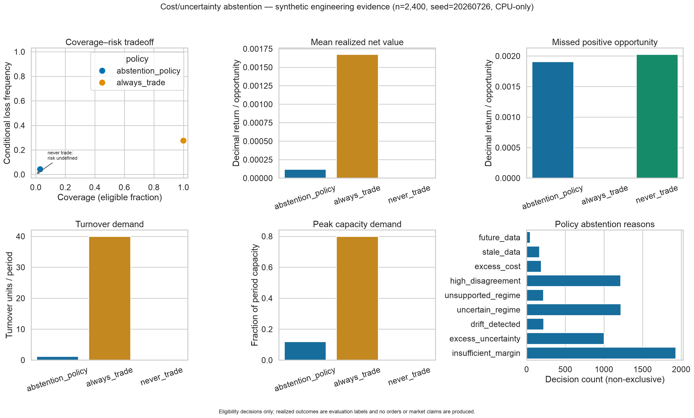

# Sprint 3 MR10 — cost/uncertainty abstention report

## Decision

**Accept the policy mechanics as a pure research boundary; reject any claim
that the committed thresholds improve total net value or establish trading
readiness.**

The reference policy selected only 71 of 2,400 synthetic opportunities. It
reduced conditional loss frequency, turnover demand, and capacity demand
relative to always-trade, but always-trade produced the higher mean realized
net value in this deliberately synthetic sample. That unfavorable comparison
is retained.

## Frozen reference

The strict `configs/decision_policy.yaml` profile fixes:

- schema `1.0.0`, PCG64 seed `20260726`, 2,400 opportunities, and 120 periods;
- a 5 bps required margin;
- a 1.25× expected-cost multiplier and 2× cost-uncertainty add-on;
- a 1.5× predictive-uncertainty charge;
- maximum cost, uncertainty, disagreement, regime-uncertainty, drift, and
  one-day age gates;
- always-trade and never-trade baselines;
- a 4,096-signal batch ceiling, linear evaluation, and deterministic
  \(O(n\log n)\) result ordering; and
- explicit false declarations for protected-holdout and broker access.

The synthetic generator includes cost, uncertainty, disagreement, unsupported
regimes, stale/future availability, drift, and realized-outcome noise. It is not
calibrated to market data. Realized return and cost are evaluation labels in a
separate immutable type and never enter a policy decision.

## Aggregate result

| Policy | Coverage | Conditional loss frequency | Mean net value | Missed opportunity | Turnover / period | Peak capacity demand |
|---|---:|---:|---:|---:|---:|---:|
| abstention policy | 2.958% | 4.225% | 0.0001195 | 0.0019086 | 1.183 | 0.12 |
| always trade | 100.000% | 27.542% | 0.0016755 | 0.0000000 | 40.000 | 0.80 |
| never trade | 0.000% | undefined | 0.0000000 | 0.0020284 | 0.000 | 0.00 |

Net value and missed opportunity are decimal return per synthetic opportunity.
Turnover and capacity are pre-portfolio demand proxies, not orders, positions,
fills, or capital claims.

The policy's non-exclusive abstention reasons were:

| Reason | Count |
|---|---:|
| future data | 46 |
| stale data | 166 |
| excess cost | 188 |
| high disagreement | 1,215 |
| unsupported regime | 218 |
| uncertain regime | 1,219 |
| drift detected | 220 |
| excess uncertainty | 1,000 |
| insufficient margin | 1,928 |

Counts exceed the 2,329 abstentions because one signal can fail several
independent gates. This is intentional diagnostic evidence, not double-counted
coverage.

The Seaborn plot was generated directly from the serialized aggregate CSVs
and visually inspected at 3,147×1,899 pixels. It shows coverage-risk, net
value, missed opportunity, turnover, peak capacity, and every observed reason.
The underlying
[aggregate metrics](evidence/signal_foundry_sprint_3/abstention_policy/aggregate_metrics.csv),
[reason counts](evidence/signal_foundry_sprint_3/abstention_policy/abstention_reasons.csv),
and [summary with hashes and resolved
configuration](evidence/signal_foundry_sprint_3/abstention_policy/summary.json)
are machine-readable.

No signal row, realized label, licensed observation, credential, prediction,
model artifact, portfolio weight, or order is published.

## Verification and interpretation

Tests cover every non-finite numeric field; negative/out-of-range inputs;
excess cost; stale and future availability; disagreement; unsupported and
unknown regimes; regime uncertainty; drift; predictive uncertainty; threshold
and strict-margin equality; reference arithmetic; monotonic cost/uncertainty
changes; stable JSON and SHA-256 identities; immutability; duplicate and batch
bounds; a deterministic operation-count benchmark at 1, 64, 4,096, and the
4,097-item failure boundary; input-order isolation; realized-label causality;
strict config; always/never baselines; aggregate-only publication; Seaborn
usage; byte-stable same-environment replay; and failure cleanup.

The reference establishes that the layer can abstain consistently and expose
its opportunity cost. It does not establish that the configured thresholds are
optimal. In this sample, always-trade captured more total net value while
accepting substantially higher loss frequency and resource demand. The policy
may be too conservative, but changing it in response to this final table would
be tuning on evaluation evidence. A future market study must pre-register any
new threshold family on development data, correct for attempted variants, and
preserve a genuinely untouched holdout.

Abstention cannot guarantee against loss. Cost and uncertainty models can be
jointly wrong, regimes can be mislabeled, and selection can concentrate hidden
risk. Nothing in this result authorizes paper or live trading.
