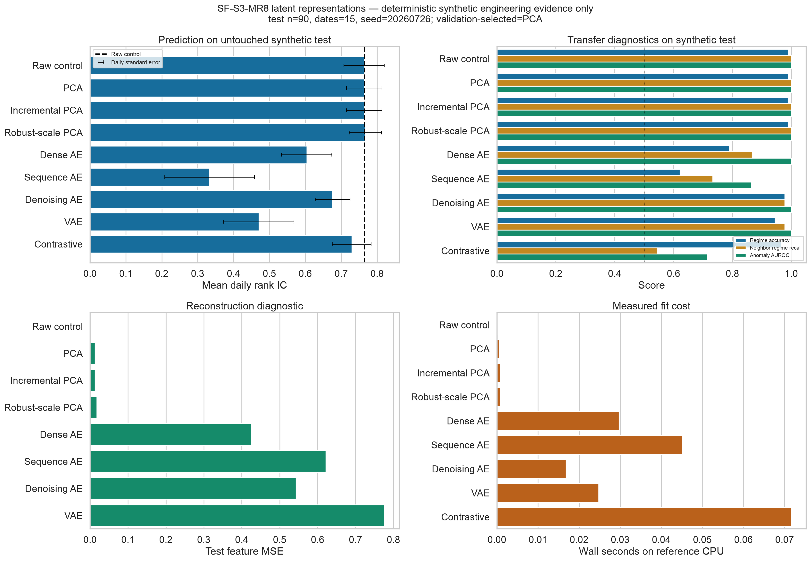

# Sprint 3 MR8 — latent-representation report

## Decision

**Qualify the leakage-safe representation machinery, but do not promote a learned
representation for predictive use.** Validation selected PCA. On the untouched
synthetic test partition, PCA tied the raw control's mean daily rank IC at
`0.7638` and increased prediction MSE by `0.0000671`.

Robust-scale PCA had the highest post-selection test rank IC (`0.7676`), but it
was not the validation winner and cannot be selected after seeing test results.
The neural candidates did not establish a predictive advantage. This result
authorizes neither a market claim nor paper or live trading.

## Frozen reference

`configs/latent_representation_benchmark.yaml` fixes seed `20260726`, nine
candidates, a four-dimensional latent budget, CPU execution, resource ceilings,
and complete-date `258 / 84 / 90` row train/validation/test partitions. The
synthetic reference has 432 rows, 72 dates, six symbols, ten features, two
planted regimes, and 47 planted anomaly rows.

Representations fit the 258 outer-training rows only. Neural candidates reserve
54 of those rows as an inner validation tail for early stopping and fit
normalization on the remaining inner-training dates. A fixed ridge evaluator
fits on outer-train embeddings. Only the 84 outer-validation rows select the
candidate; the 90 test rows across 15 dates are then summarized.

## Prediction, reconstruction, and compute

Daily standard errors describe variation across the 15 test dates and do not
correct for serial dependence.

| Candidate | Validation rank IC | Test rank IC ± daily SE | Test MSE delta vs raw | Reconstruction MSE | Stop | Fit wall seconds |
|---|---:|---:|---:|---:|---|---:|
| Raw control | 0.6816 | 0.7638 ± 0.0566 | 0.000000 | ~0 | closed form | 0.0002 |
| **PCA (selected)** | **0.7143** | **0.7638 ± 0.0495** | **+0.000067** | 0.0127 | closed form | 0.0006 |
| Incremental PCA | 0.7143 | 0.7638 ± 0.0495 | +0.000067 | 0.0127 | closed form | 0.0009 |
| Robust-scale PCA | 0.7020 | 0.7676 ± 0.0448 | +0.000072 | 0.0175 | closed form | 0.0008 |
| Dense autoencoder | 0.7102 | 0.6038 ± 0.0702 | +0.001255 | 0.4256 | epoch ceiling | 0.0297 |
| Sequence autoencoder | 0.5592 | 0.3333 ± 0.1250 | +0.002794 | 0.6216 | epoch ceiling | 0.0451 |
| Denoising autoencoder | 0.5224 | 0.6762 ± 0.0485 | +0.002176 | 0.5430 | epoch ceiling | 0.0168 |
| Variational autoencoder | 0.6898 | 0.4705 ± 0.0978 | +0.001557 | 0.7760 | epoch ceiling | 0.0247 |
| Contrastive time series | 0.6980 | 0.7295 ± 0.0542 | +0.000855 | not applicable | validation patience | 0.0716 |

Wall times are one measured fit on an Apple arm64 CPU with no warmup, not
latency distributions or cross-machine performance claims. Stable state IDs and
numeric metrics exclude timing. The four autoencoder candidates that reached ten
epochs are explicitly `converged=false`; only the contrastive neural candidate
triggered the patience rule.

## Transfer and diversification diagnostics

The planted anomalies are intentionally easy: the raw and PCA-family controls and
several neural encoders reached anomaly AUROC `1.0`. That is a generator
diagnostic, not a realistic anomaly-detection claim.

| Candidate | Regime accuracy | Neighbor regime recall | Anomaly AUROC | Effective rank | Mean absolute latent correlation |
|---|---:|---:|---:|---:|---:|
| Raw control | 0.9889 | 1.0000 | 1.0000 | 3.223 | 0.453 |
| PCA | 0.9889 | 1.0000 | 1.0000 | 3.008 | 0.294 |
| Incremental PCA | 0.9889 | 1.0000 | 1.0000 | 3.008 | 0.294 |
| Robust-scale PCA | 0.9889 | 1.0000 | 1.0000 | 2.765 | 0.309 |
| Dense autoencoder | 0.7889 | 0.8667 | 1.0000 | 2.270 | 0.431 |
| Sequence autoencoder | 0.6222 | 0.7333 | 0.8651 | 1.568 | 0.714 |
| Denoising autoencoder | 0.9778 | 0.9778 | 1.0000 | 2.116 | 0.347 |
| Variational autoencoder | 0.9444 | 0.9778 | 1.0000 | 1.860 | 0.626 |
| Contrastive time series | 0.9667 | 0.5444 | 0.7143 | 1.766 | 0.629 |

Compression generally reduced effective rank by construction. PCA lowered mean
absolute component correlation relative to the raw control, while the sequence,
variational, and contrastive encoders produced more correlated four-dimensional
embeddings on this reference. No single representation dominated prediction,
similarity, anomaly, diversification, reconstruction, and compute.

## Evidence and safety

The figure was generated through Seaborn from
[`candidate_summary.csv`](evidence/signal_foundry_sprint_3/latent_representations/candidate_summary.csv)
and visually inspected at 3147×2183. It displays the raw prediction baseline,
daily rank-IC standard errors, transfer tasks, reconstruction failures and
successes, and measured fit cost rather than only the selected result.
[`summary.json`](evidence/signal_foundry_sprint_3/latent_representations/summary.json)
records split, environment, selection, and limitations;
[`manifest.json`](evidence/signal_foundry_sprint_3/latent_representations/manifest.json)
binds file hashes and the aggregate-only publication policy.

Focused tests cover finite/schema/resource rejection, inference before fit,
collapsed embeddings, exact reconstruction behavior, PCA sign and rotation
ambiguity, incremental and robust-scaling semantics, causal per-symbol windows,
fit-only augmentation, deterministic CPU fits, candidate-order independence,
held-out target mutation, strict config fields, validation-only selection,
transactional publication cleanup, Seaborn use, and file-hash integrity.

No raw feature row, target, embedding, prediction, tensor, model weight, cache,
credential, or licensed dataset is published. The code accepts no broker
authority. The evidence is offline synthetic engineering evidence and contains
no transaction-cost, portfolio, capacity, or profitability result.

## Next legitimate evidence

A subsequent study may carry this contract into AlphaForge's governed
walk-forward boundary, but it must pre-register the candidate family and
selection rule, use licensed point-in-time data, fit every representation inside
each training fold, report dependence-aware matched-fold uncertainty, account for
all attempted variants, include realistic costs and simple investable baselines,
and preserve a final untouched interval. This MR supplies the mechanism, not that
market evidence.
