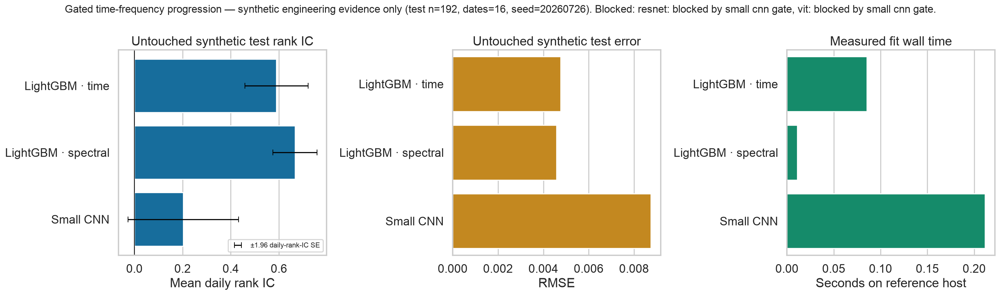

# Sprint 3 MR7 — time-frequency vision progression report

## Decision

**Reject progression beyond the mandatory small CNN on the committed synthetic
engineering reference.** The small CNN failed its predeclared validation gate
against LightGBM spectral descriptors. ResNet and ViT were not trained.

This decision is the intended behavior of the system. A more complex model is
not a deliverable unless simpler evidence authorizes it.

## Scope completed

- Added a strict consumer for Signalattice's
  `[sample, channel, frequency, within-window time]` tensor semantics.
- Added deterministic train-only normalization, target scaling, financially
  meaningful robustness perturbations, and bounded small-CNN/ResNet/ViT
  implementations.
- Added tamper-evident, policy-bound, validation-only progression records.
- Added a chronological study that finalizes gates before touching test rows.
- Added LightGBM time/spectral baselines, compute reporting, rank-IC uncertainty,
  a simple cost diagnostic, aggregate-only publication, and a Seaborn plot.
- Added ADR 0004, operator/mathematics documentation, CLI/Make entry points,
  frozen configuration, and adversarial tests.

## Reference evidence

Configuration: `configs/time_frequency_vision_benchmark.yaml`; seed `20260726`;
CPU; 960 synthetic observations, 80 dates, 12 symbols, tensor shape
`[960, 3, 8, 4]`; split 576/192/192 observations.

| Candidate | Status | Validation rank IC | Test rank IC ± daily SE | Test RMSE | Fit wall seconds |
|---|---:|---:|---:|---:|---:|
| LightGBM time | evaluated | 0.5621 | 0.5895 ± 0.0669 | 0.00476 | 0.0853 |
| LightGBM spectral | evaluated | 0.5988 | 0.6665 ± 0.0466 | 0.00459 | 0.0112 |
| Small CNN | evaluated | 0.0769 | 0.2024 ± 0.1171 | 0.00874 | 0.2116 |
| ResNet | blocked by small-CNN gate | — | — | — | — |
| ViT | blocked by small-CNN gate | — | — | — | — |

The small-CNN gate passed sample count, date count, and minimum absolute rank
IC. It failed the maximum `-0.10` permitted incremental-rank-IC deficit and the
maximum `1.25` RMSE ratio. Gate evidence SHA-256:
`9d6b7ba7eea3402c2a4f73fe79a0b1d2675ebae2d409cfdb4ee5ab13c73ff53d`.

The plot was generated with Seaborn, includes the untouched-test observation
count, dates, seed, daily-rank-IC standard-error bars, compute, and blocked
architectures, and was visually inspected at its original 3204×932 resolution.

## Validation and safety

Focused tests cover malformed shapes, dtypes, masks, infinities, duplicate
alignment, frequency grids, finite targets/features, allocation bounds,
deterministic perturbation, contiguous frequency masking, train-only fitted
state, causality across independent samples, parameter bounds, unavailable
state, all three authorized implementations, test-gate rejection, policy
mismatch, predecessor order, failed gates, digest tampering, strict config,
chronological separation, no-ViT-first ordering, blocked metrics, atomic
cleanup, runtime metadata, aggregate-only publication, and Seaborn calls.

No credential, licensed row, tensor, checkpoint, cache, or row prediction is
published. The neural code has no broker boundary. The evidence is synthetic,
does not qualify paper/live readiness, and does not imply profit.
