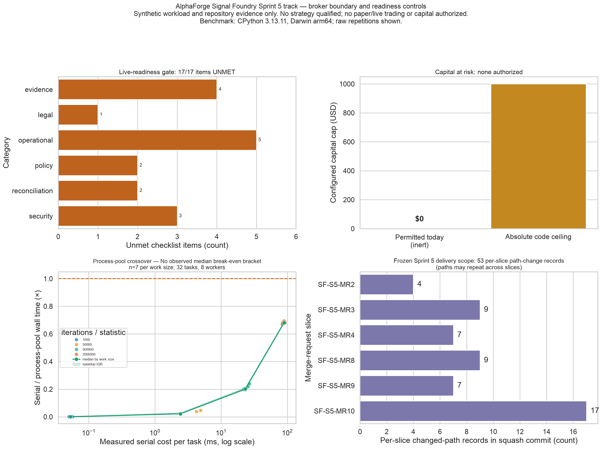

# AlphaForge Signal Foundry Sprint 5 track — broker boundary and live readiness

**Outcome: the plumbing between a backtest and a broker now exists, and the gate
at the end of it is closed with all seventeen items unmet.**

*Four panels, three of them unflattering by design: the readiness gate with every
item unmet, the capital cap sitting at zero against its ceiling, and every raw
repetition in the local/process-pool crossover study. The fourth is an exact
Git-object inventory of per-slice tracked-path changes; repeated changes to one
path remain separate records, and the result is not a test or effort count.
Synthetic workload and repository evidence only; no market data, broker
connection, paper/live authorization, or capital at risk. Regenerate with
`python scripts/publish_sprint_5_evidence.py --output /new/review/path`; the
publisher intentionally refuses the committed destination.*

---

## What shipped

| MR | Issue | Slice |
| --- | --- | --- |
| SF-S5-MR2 | [#99](https://github.com/srgangaram-swe/AlphaForge/issues/99) | Broker connectivity requirements and selection (docs only) |
| SF-S5-MR3 | [#45](https://github.com/srgangaram-swe/AlphaForge/issues/45) | Broker-neutral contract and deny-by-default paper adapter |
| SF-S5-MR4 | [#46](https://github.com/srgangaram-swe/AlphaForge/issues/46) | Durable session state and halt-on-divergence reconciliation |
| SF-S5-MR8 | [#47](https://github.com/srgangaram-swe/AlphaForge/issues/47) | Bounded distributed research execution |
| SF-S5-MR9 | [#48](https://github.com/srgangaram-swe/AlphaForge/issues/48) | Checkpoint bindings and hard budgets |
| SF-S5-MR10 | [#49](https://github.com/srgangaram-swe/AlphaForge/issues/49) | Live-readiness gate and inert capital configuration |

ADRs 0015–0020 describe the implementation decisions. [ADR
0022](adr/0022-content-addressed-sprint-evidence.md) corrects the close-out
measurement method. The figure's delivery panel is generated from the frozen
commit/path/blob ledger in
[`delivery_inventory.json`](evidence/signal_foundry_sprint_5/closeout/delivery_inventory.json);
it deliberately reports path-change records rather than unique paths and makes
no claim about test count, effort, or quality. It covers the six planned
capability slices from SF-S5-MR2 through SF-S5-MR10; the two evidence-correction
attempts remain visible in Git/PR history but are excluded to avoid circular
self-provenance and because they add no seventh trading capability.

## Three findings worth keeping

**A highly parallel workload can still lose to a `for` loop.** MR8 profiled the
robustness sweep at a 0.9727 parallel fraction—an Amdahl ceiling of 36.6×. That
number alone can make distribution look compelling. The repeated reference
benchmark also measures the fixed process cost, retains every raw sample, and
reports its dispersion. On the recorded macOS `spawn` environment, every median
is a slowdown and no break-even is observed through the largest declared work
size. Dask remains selected as the future target in ADR 0018, but its historical
single-sample crossover is not treated as current evidence and the dependency is
not adopted. Distributing without measuring fixed cost would have been a
regression presented as an improvement.

**Idempotency that lives in a process does not survive a restart.** MR3 made a
replayed decision cycle a no-op by remembering client order IDs in a dictionary.
MR4 found the hole: a restart empties it, and the broker's own dedupe window is far
shorter than the gap between an evening crash and a morning restart. Intent is now
persisted *before* the broker is contacted, because the window between "decided"
and "acknowledged" is exactly where duplicates are born.

**Repairing a divergence destroys the evidence needed to explain it.** When the
local book says 100 shares and the broker says 150, the cause is an unrecorded
fill, a duplicate submission, a manual intervention, or a bug — four causes with
four different correct responses. Reconciliation therefore halts and never
repairs, and never liquidates: an automatic flatten is a market order sized from
exactly the position you are unsure about.

## Where this leaves live trading

The [live-readiness gate](live_readiness.md) is **`NOT_READY`, 17 of 17 items
unmet**:

| Category | Unmet |
| --- | --- |
| Operational | 5 — rehearsal, broker-failure drill, kill switch, deactivation, audit/tax export |
| Evidence | 4 — qualified candidate, paper duration, paper stability, cost validation |
| Security | 3 — capital cap, risk limits, credential custody |
| Reconciliation | 2 — clean history, current broker state |
| Policy | 2 — employment policy, owner approval |
| Legal | 1 — legal and regulatory review |

The first evidence item is blocked by research rather than engineering: Sprint 4's
qualification verdict was `REJECTED` with 7 of 8 criteria failing. No amount of
infrastructure produces a qualified strategy.

**Capital at risk: $0.** The configuration is inert by default, and there is no
method anywhere capable of raising a cap.

## Honest limitations

- **The readiness framework cannot verify attestations.** Employment-policy and
  legal review are human judgements; a false attestation produces a READY verdict.
  The framework narrows the hole to a named person on a dated record with a
  180-day expiry, and prints "Recorded, not verified" on the record. It cannot
  close it.
- **No broker connection exists.** MR3's adapter is an in-process simulation with
  no network client, asserted by parsing its imports. Paper fills carry no queue
  position, no contention, and no borrow scarcity; they bound *operational*
  readiness only.
- **Two MR8 acceptance criteria were not claimed**: network-partition testing
  (there is no network) and GPU scheduling (declared and validated, honoured by no
  backend). Both were re-scoped in writing on [#47](https://github.com/srgangaram-swe/AlphaForge/issues/47)
  rather than marked done.
- **Signalattice's Sprint 5 track is separate and still open** — eight issues
  covering the FastAPI service, run registry, TypeScript console, telemetry,
  shadow forecasting, champion-challenger governance, signed release, and
  benchmark dossier. This report covers AlphaForge only.
- **Performance evidence is single-machine wall clock**, with the exact Python,
  platform, machine, logical CPU count, process-start method, timing clock,
  warm-up count, raw repetitions, workload/harness source identities, dependency
  lock, and task-declaration graphs recorded in the committed input. It is not a
  cluster benchmark or SLA.

## What would change the verdict

In dependency order: a qualified candidate (research, not engineering), then a
paper-trading period long enough to produce stability and cost-validation
evidence, then the operational drills, then the two human attestations. The gate
is deliberately ordered so the first item cannot be satisfied by effort.
