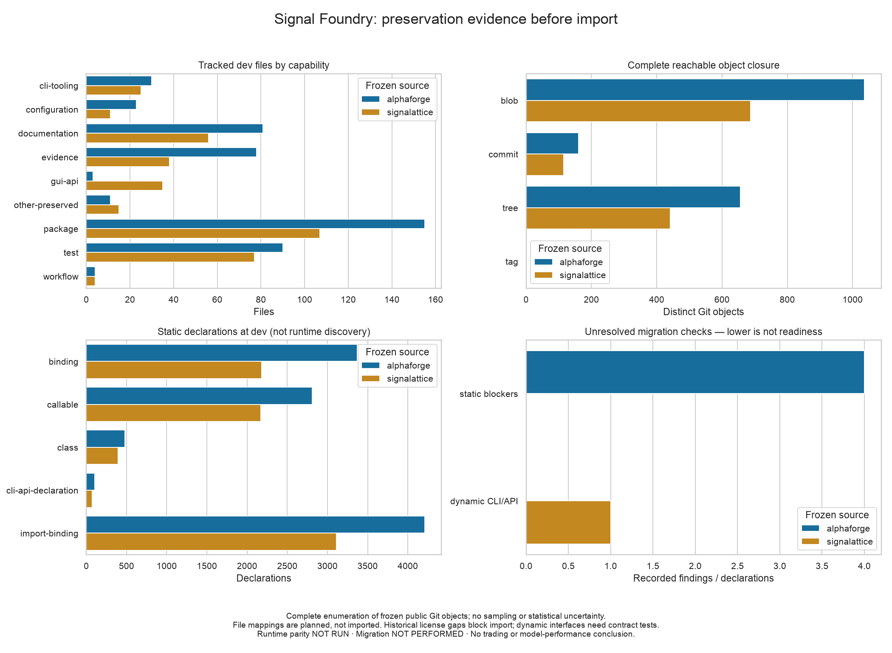

# Sprint 6 MR1: provenance before repository consolidation

This is the pre-import architecture and evidence slice for AlphaForge #78, not
the completion of the entire mini-sprint. [ADR 0023](adr/0023-lossless-signal-foundry-preservation.md)
selects original-object merge ancestry, exact prefixed source trees, independent
package environments, and a later typed Nexus control plane. No actual source
import, runtime change, repository archive or trading action occurred.

## Frozen evidence

| Exhaustive enumeration | AlphaForge | Signalattice |
| --- | ---: | ---: |
| Advertised refs, including PR refs | 86 | 52 |
| Reachable Git objects | 1,852 | 1,246 |
| Historical commit root trees | 91 | 67 |
| Historical tracked path records | 28,525 | 14,378 |
| Tracked dev files / planned exact mappings | 475 / 475 | 368 / 368 |
| GitHub issue/PR traceability records | 121 | 85 |
| Historical missing-license findings | 4 | 0 |

The source identities are AlphaForge dev `d3a4250d0375cc419c8abc73c5f7b8ef9eeb119a`
and Signalattice dev `c5b3d2ec3a1f3b585ee42a0a60638cdf7cc41768`. All other branch,
tag, default-branch, lock, notice, workflow, release and historical identities are
recorded in the [complete ledgers and snapshots](evidence/signal_foundry_sprint_6/).
The freeze precedes the planning MR to avoid a self-referential artifact. MR2 must
review source advances rather than assuming these are permanently current tips.

The four Seaborn panels show current file capability counts, full reachable object
closure, syntactic declarations, and unresolved static/dynamic checks. These are
complete enumerations, not samples or performance measurements. Counts of declarations
include imports/bindings and test declarations; they are not counts of distinct
runtime public APIs. Exact CLI/API literals and declaration lines are retained where
statically identifiable. Dynamic behavior still requires the original contract suites.

The final plot was visually inspected for legibility, zero-based axes, categorical
units, source labels, limitations, and the explicit lack of completed migration or
runtime parity. Its SHA-256 is
`7f99b93e638f5dbfc9f30a4316b945bf709c834d6edb3c2419755d09d1a33821`.

## Independent recovery and deterministic reproduction

Both actual source mirrors were backed up into self-contained private bundles,
verified, restored into fresh mirrors, and independently re-inventoried. Their
canonical ledgers matched byte for byte. All derived JSON snapshots, aggregates
and PNG output also matched byte for byte across the two runs.

- AlphaForge ledger SHA-256: `680a937014aec2b8cc7f3a7e5367880e6086090a99c3ed3e3eff2cfaa4633267`.
- Signalattice ledger SHA-256: `0e1bf82cdeb8b631e7bebdfd1be133b4e74ac0fa9c989939266ef2f8859b14e5`.
- Private AlphaForge bundle SHA-256: `308c2aea87676693ecddef23048d609b2c25ed602bb5dd9a5659df8befe3a97d`.
- Private Signalattice bundle SHA-256: `6f1d4ab76c4243d695fc70bbbe5144d5c82917410abb28b31accea6fa2598d07`.

Bundle byte identity is a recovery receipt, not a promise that a future Git packer
will produce the same compression. Restored ref/object identity is the invariant.
Both original repositories remain intact. Signalattice's signed v0.3.0 and v0.3.1
tag objects are retained unchanged in the inventory and recovery copies.

Local reproduction used macOS, Python 3.13.11, the committed AlphaForge dependency
lock, deterministic enumeration and no random scientific sampling. The property
test uses seed 785. GitHub metadata capture was the only network data step; the
inventory, fixture import drill, restored-ledger comparison and plots are offline.
No provider request, licensed/raw market observation, model, secret, source blob or
machine-local path is part of the public evidence.

## Validation and remaining gates

The targeted suite exercises unit, randomized property, malformed-repository,
fault/boundary, public CLI, publication, metadata and real Git integration behavior.
The dry-run import combines two independent fixture histories under separate prefixes,
retains both same-named annotated tags under namespaced refs, preserves unmerged
ancestry, and proves recovery without touching the real source repositories.

Repository lint/format, typing, configuration validation, frozen-lock checking,
pre-commit policy and wheel/sdist builds are also checked. The owner permitted
targeted local test execution for this planning-only change; the runtime algorithms,
dependency resolution and required remote suites have not been changed. The PR is
the authoritative record of exact final local counts and remote gate results.

AlphaForge's four missing historical license notices remain **BLOCKED** and are
linked to the MR2 licensing determination. The inventory deliberately preserves
those trees instead of deleting or retroactively editing them. Signalattice's static
scan passes, but dynamic interface qualification and both projects' relocated runtime
parity remain **NOT RUN**. The monorepo migration remains **NOT PERFORMED**. No source
evidence class, profitability conclusion or financial authority has been upgraded.
